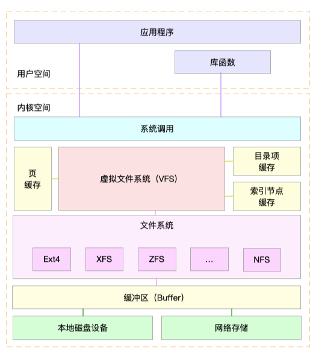
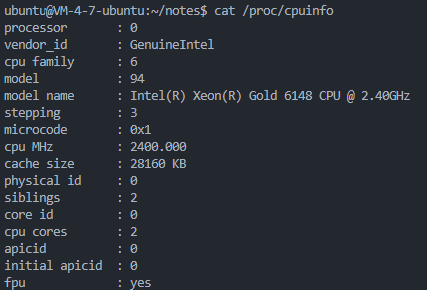
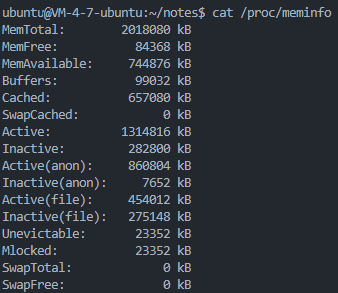
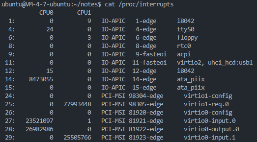
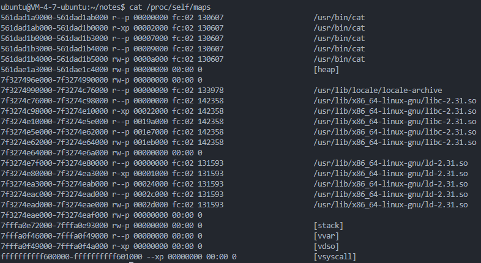

# 虚拟文件系统

虚拟文件系统（VFS）是Linux内核的一个重要子系统，它为用户空间程序提供了一套统一的接口，以实现对不同文件系统的访问和操作。通过这些接口，用户空间程序可以采用标准的系统调用来执行文件操作，而无需关心这些操作实际是在哪种文件系统上执行的。VFS使得内核能够支持多种文件系统类型，如ext4、ReiserFS、XFS等。对于用户空间程序来说，这些文件系统看起来都是一样的，因为VFS隐藏了底层文件系统的差异。VFS的设计使得Linux内核能够灵活地支持多种文件系统，同时保持用户空间程序的稳定性和可移植性。这对于Linux系统的可扩展性和灵活性至关重要。

为了支持多文件系统，VFS提供了一个通用文件系统模型的抽象层，该模型囊括了任何文件系统常用的功能和行为。用户空间程序只需要使用VFS暴露的接口，而无须关心底层文件系统的实现细节。比如调用一个简单的`write()`函数，首先由VFS转换为`sys_write()`，再根据fd文件描述符所在的文件系统，找到具体的实现方法，最后再执行该操作。



通过这张图我们可以看到，VFS支持多种不同的文件系统，按照存储位置的不同，这些文件系统可以分为三类：

- 基于磁盘的文件系统，也就是把数据直接存储在本地磁盘中。常见的由Ext4、XFS、OverlayFS等。

- 基于内存的文件系统，不需要磁盘分配存储空间，但会占用额外的内存。/proc文件系统就属于这一类。

- 基于网络的文件系统，用来访问其他计算机数据的文件系统，比如NFS。

不管是哪类文件系统，都需要挂载到VFS目录树中的某个子目录，才能被用户空间程序访问到。拿基于磁盘的文件系统为例，在安装系统时，就需要指定挂载点——{==根目录==}（ / ），在根目录下再把其他文件系统挂载进来。

Linux系统总共采用了四种核心概念来抽象文件系统：文件、目录项、索引点和挂载点。这些概念共同构建了一个分层的数据存储结构，用于管理文件和目录及相关的控制信息。Linux文件系统的一个重要特点是统一的命名空间，所有的文件被挂载到一个全局的层次结构中，形成一个类似根文件系统的结构。这与Windows系统将文件系统划分不同的分区不同。

Linux系统区分文件本身和文件相关的信息，比如访问控制权限、大小、所有者、创建时间等。这些相关信息，有时被称作文件的{==元数据==}，被存储在一个单独的数据结构中——索引节点（inode）。

## VFS对象

VFS使用一组数据结构来代表通用文件对象，它们分别是：

- 超级块对象，代表一个具体的已安装的文件系统。
- 索引节点对象，代表一个具体文件。
- 目录项对象，代表一个目录项，是一个路径的组成部分。
- 文件对象，代表由进程打开的文件。

每个通用对象都包含一个操作对象，描述了内核对通用对象的方法——super_operations、inode_operations、dentry_operations、file_operations。

### 超级块对象

超级块对象是用来描述一个已安装的文件系统的数据结构，包含了文件系统的关键元数据，这些元数据用于内核管理和维护文件系统。超级块对象是文件系统在内核中表示自己的方式，它提供了文件系统的总体视图。超级块对象由`struct super_block`结构体表示，通过`alloc_super()`函数创建并初始化。在文件系统安装时，会调用该函数以便从磁盘中读取文件系统超级块。

超级块操作由`struct super_operations`结构体表示，该结构体中的每一项都是一个指向超级块操作函数的指针。

### 索引节点对象

```C title="inode结构体"
struct inode {
	umode_t			i_mode;					/*inode的权限*/
	unsigned short		i_opflags;			/*操作标志*/
	kuid_t			i_uid;					/*inode拥有者ID*/
	kgid_t			i_gid;					/*inode所属群组ID*/
	unsigned int		i_flags;			/*inode标志位*/
	dev_t i_rdev;							/*记录设备号*/
	loff_t i_size;							/*inode的文件大小*/

	struct timespec64	i_atime;			/*最近一次存取时间*/
	struct timespec64	i_mtime;			/*最近一次修改时间*
	struct timespec64	i_ctime;			/*创建时间*/

	union {
		struct pipe_inode_info	*i_pipe;	/*指向管道文件*/
		struct cdev		*i_cdev;			*指向字符设备*/
		char			*i_link;
		unsigned		i_dir_seq;
	};

	...
} 
```

索引节点对象代表一个文件或目录在文件系统中的逻辑表示，包含了关于文件或目录的元数据，这些元数据描述了文件或目录的属性，如权限、所有者、文件大小、最后访问和修改时间等。索引节点对象由`struct inode`结构体来表示。每个文件系统都有一个索引节点表，该表包含了所有索引节点对象的引用。当用户空间程序通过标准的文件操作系统调用（如 `open()`、`read()`、`write()`等）与文件系统交互时，它们实际上是在与索引节点对象进行交互。

与超级块类似，索引节点操作由`struct inode_operations`结构体表示。

### 目录项对象

在VFS中，目录被当作文件来处理，这允许用户空间程序以相同的方式对文件和目录进行操作。因此，在路径/bin/vi中，bin和vi都被视为文件。这里的bin是一个特殊的目录文件，它包含了指向系统中可执行文件的链接，而vi是一个普通文件，包含了文本编辑器的源代码。

在VFS中，路径中的每个组成部分（无论是普通文件还是目录）都是由一个索引节点对象表示的。

为了简化路径名查找等目录相关的操作，VFS引入了目录项的概念。目录项对象是路径中的一个特定部分，它包含了对索引节点对象的引用以及文件名和其他相关信息。这样，VFS在进行路径名查找时，就不必对整个路径进行逐字字符串比较，而是可以基于目录项对象快速定位到目标文件或目录。

目录项对象还包括了挂载点，这是文件系统挂载时的根目录。例如，在路径/mnt/cdrom/foo 中，/、mnt、cdrom 和foo都是目录项对象。VFS在执行目录操作时会现场创建目录项对象。

目录项对象由`struct dentry`结构体表示。

由于文件的访问呈现空间和时间的局部性，为了提高程序访问文件的性能，VFS对于目录项和索引节点进行了缓存，以减少对于磁盘的访问操作。目录项缓存的工作原理如下：

1. 缓存数据：当内核需要访问一个文件或目录时，它会首先检查目录项缓存中是否已经存在该目录项的数据。如果数据在缓存中，内核将直接使用缓存中的数据，而不是从磁盘读取。

2. 缓存更新：当内核修改了目录项的数据（例如，创建、删除或重命名文件或目录）时，它会将修改后的数据写入目录项缓存。这样，下一次访问相同的数据时，内核可以直接从缓存中获取，而不是再次访问磁盘。

3. 缓存清理：为了保持缓存的数据是最新的，内核会定期或根据需要清理缓存，移除不再引用的目录项数据。

4. 缓存一致性：在多核系统中，为了保持缓存的一致性，内核会使用各种缓存一致性协议（如MESI协议）来同步缓存数据。

目录项操作由`struct dentry_operations`结构体表示。

### 文件对象

`struct file`结构体表示一个打开的文件，它包含了与文件相关的各种信息，如文件描述符、文件状态、文件偏移量、文件操作表等。在文件的所有实例都关闭后，内核释放这个数据结构。

驱动程序重点关注文件读/写模式f_mode、标志f_flags，私有数据指针private_data被广泛应用于驱动程序自定义描述设备的结构体。

!!! note 

	不同进程可以操作同一文件，在结构体中用f_count作为引用计数。

`struct files_operations`定义了与文件有关的操作函数。

总的来说，内核为每个文件都分配两个数据结构——索引节点和目录项，分别用来记录文件的元数据和目录结构。索引节点是文件的唯一标志，多个目录项可以指向同一个索引节点。比如通过硬链接为文件创建别名，虽然目录位置不同，但是链接的是同一个文件，因此索引节点一致。

## 进程中的文件数据结构

在[进程管理](./sched.md/)章节中，我们提到了在进程描述符`tast_struct`中有两个与文件系统相关的成员变量：

```C
struct fs_struct *fs;
struct files_struct *files;
```

`fs_struct`包含文件系统和进程相关的信息，定义在文件<linux/fs_struct.h\>中：

```C
struct fs_struct {
	int users;
	int umask;
	int in_exec;
	struct path root, pwd;
};
```

> user：当前打开该文件的用户数量。

> umask：用户模式掩码，决定了系统在创建文件和目录时的默认权限掩码。

> in_exec：表示文件系统是否处于执行模式。

> root，pwd：根目录路径和当前工作目录路径。

`files_struct`标识进程打开的文件信息，定义在文件<linux/fdtable.h\>中：

```C
struct files_struct {
	atomic_t count;
	
	struct fdtable __rcu *fdt;
	struct fdtable fdtab;
  
	unsigned int next_fd;
	unsigned long close_on_exec_init[1];
	unsigned long open_fds_init[1];
	unsigned long full_fds_bits_init[1];
	struct file __rcu * fd_array[NR_OPEN_DEFAULT];
};
```

> count：跟踪当前打开的文件描述符的数量。

> fd：缓存下一个可用的fd。

> fd_array：指向一个`struct file`结构体的数组，用于存储打开的文件描述符。在64位体系中，一个进程默认可以打开64个文件对象。

还有一个非常重要的结构体是`namespace`，定义在文件<linux/mount.h\>中。它可以使每一个进程在系统中都看到唯一的文件系统层次结构，是Linux三大隔离技术之一。具体的细节就不在这里探讨了，在[容器技术](../../cloud/docker.md)一章会再做详细介绍。

上述这些数据结构都是通过进程描述符链表连接起来的。对于多数进程，它们的描述符都指向唯一的`files_struct`和`fs_struct`结构体。但是对于那些在调用`clone()`函数时指定了克隆标志CLONE_FILES或者CLONE_FS的进程，会共享这两个结构体。

`namespace`结构体的使用方法比较特殊。默认情况下，所有进程都是共享一个命名空间的，只有当`clone()`函数时指定了{==CLONE_NEWS==}标志，才会给进程一个唯一的命名空间结构体的拷贝。

## proc文件系统

proc文件系统是一种特殊的文件系统，它的信息并不保存在磁盘上而是实时生成的。proc文件系统提供了内核各个子系统的信息，比如进程信息、内存信息、网络信息等，使得用户能够以文件的方式访问系统状态。

下面对proc目录下几个常用文件的内容，和使用场景做一个简单的说明。

### /proc/self

每个进程在proc目录下都有一个对应的子目录，通过该进程的PID来命名，为了简化对当前进程的描述，Linux提供了一个特殊的目录：/proc/self。它指向当前进程的proc目录，可以省去写PID的麻烦。

### /proc/cpuinfo

该文件包含了当前系统CPU的参数信息，包括CPU的核心数量、每个核心的工作频率、缓存大小等。



### /proc/meminfo
、
该文件显示的是系统中当前内存的使用情况，比如物理内存容量、已使用内存、空闲内存、共享内存、交换内存大小等。日常开发过程中`top`命令查看系统资源使用情况时，就是通过读取该文件获取的。相比于`top`命令，该文件提供了更为详细的内存状态信息，比如slab内存占用量、可回收内存量、内存栈空间大小、使用`malloc()`分配的堆内存量、使用`mmap()`映射的内存量等。




### /proc/kallsyms

该文件是一个符号表，包含了内核所有的全局变量和函数在内存中的地址。

这是一个帮助内核开发者调试内核而加入的文件，在Linux系统崩溃产生的信息中，函数调用堆栈中显示出来的函数名，就是在这个文件的帮助下产生的。

### /proc/interrupts

该文件记录了系统在每个CPU上处理的各类中断的统计信息。



### /proc/loadavg

该文件显示系统在过去一段时间的平均负载：


从左到右分别是：

- 过去一分钟的系统平均负载
- 过去五分钟的系统平均负载
- 过去十五分钟的系统平均负载
- 采样时刻运行队列的任务数/系统中活跃的总任务数
- 采样时刻占用最大的线程ID

输出的前三个值经常被用来观察系统负载的发展趋势，如果前面的值比后面的值大，说明系统的负载呈现上升趋势。

### /proc/PID/

这是包含进程运行信息的目录，系统会为每一个进程维护一个以PID命名的目录，在该目录下保存该进程运行时的各种状态数据，比如运行状态（status）、虚拟内存映射信息（maps）、打开的文件描述符（fd）、创建的网络套接字等。

其中用的比较多的，应该是虚拟内存映射信息（maps）：



### /proc/net/

该目录下保存了系统网络相关的信息，比如网络接口、网络协议栈、网络连接、网络路由表等。最常用的/proc/net/dev保存了通过各网络接口传输的数据的统计量，经常用它来查看网络流量和检查网络传输质量。

## sys文件系统

见[设备模型sysfs](../drivers/device_model.md/#sysfs)一节。