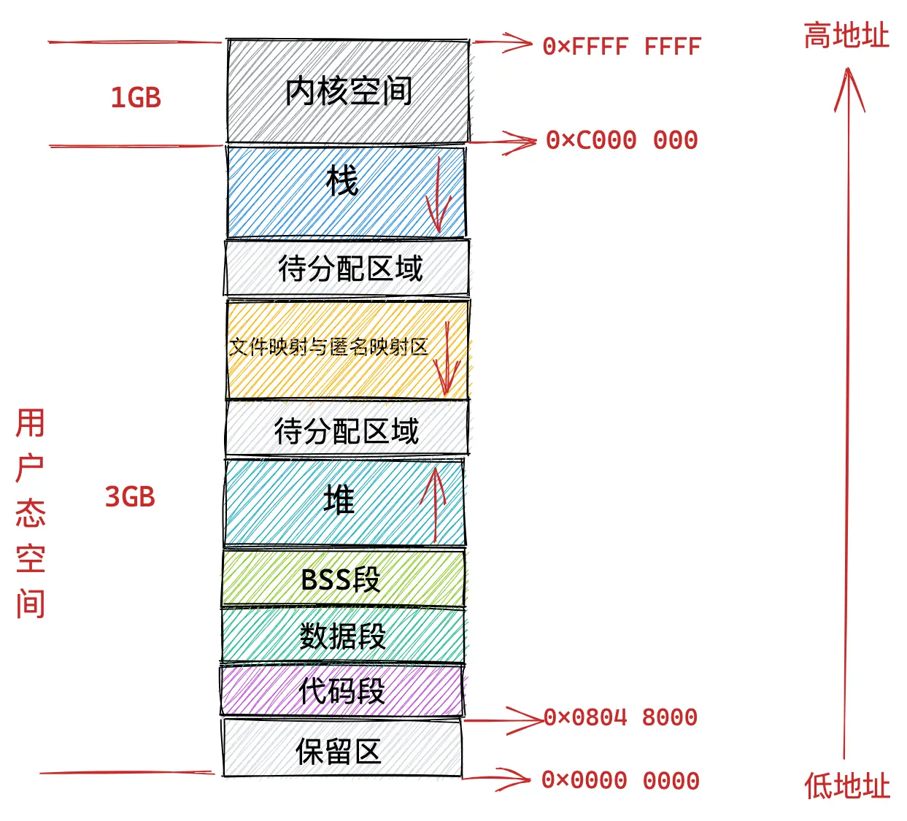
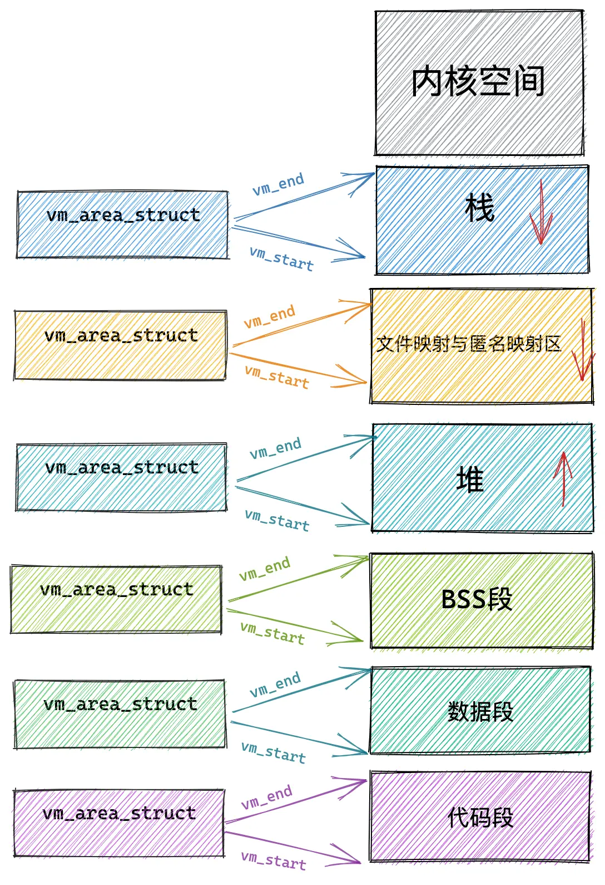
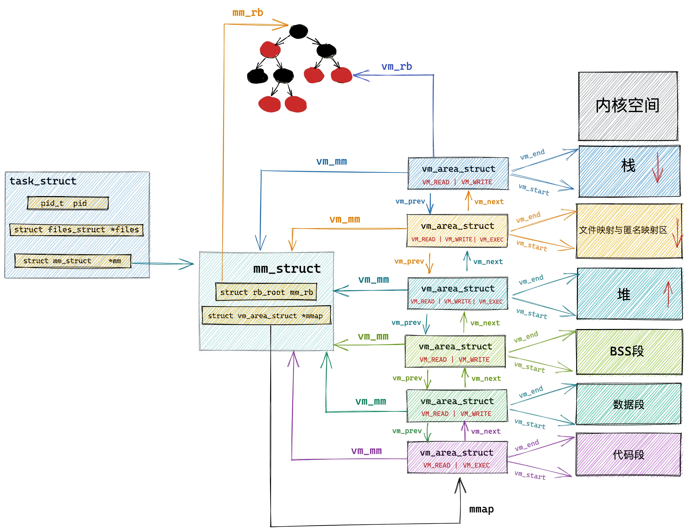

# 进程地址空间

内核除了管理本身的内存外，还必须管理用户空间中进程的内存。我们称这个内存为进程地址空间。Linux操作系统采用虚拟内存技术，对一个进程而言，它以虚拟的方式访问整个系统的所有物理内存，甚至其虚拟空间可以远远大于物理内存。

为什么要有虚拟内存？

在考虑两个程序同时操作物理内存的场景时，我们必须谨慎地为它们分配内存地址，并确保每个程序仅访问其被分配的内存区域，防止地址冲突。手动管理内存地址会极大地增加编程的复杂性。然而，如果我们能够实现一种机制，它可以为每个进程提供一套隔离的虚拟地址空间，操作系统将为这些虚拟地址映射到物理内存，且每个进程都独立于其他进程操作，那么这将极大地简化编程工作。这种机制就是虚拟内存管理，而操作系统中的内存管理单元（MMU）则负责将虚拟地址转换为物理地址。

Linux采用了基于分页的虚拟内存管理机制，其中内存被划分为大小固定的页，每一页通常是4KB。这种分页机制使得内存管理更加灵活和高效。在Linux中，虚拟地址到物理地址的转换是通过多级页表来实现的，这种分级结构可以有效地管理大型地址空间，同时减少内存占用。为了提高地址转换的速度，现代CPU设计通常包括一个称为转换后援缓冲器（TLB）的硬件缓存。TLB缓存了最近使用过的页表项，这样当CPU需要访问一个内存地址时，它首先检查TLB，如果找到了匹配的条目，这个操作被称为TLB命中，可以快速完成地址转换，避免访问主内存中的页表，从而显著提升性能。当发生TLB未命中的情况时，CPU必须访问主内存中的页表来获取正确的物理地址，这会导致较大的性能开销。因此，操作系统和硬件设计者都会尽量优化TLB的命中率，以减少这种开销。

## 地址空间的概念

进程的地址空间由可寻址的虚拟内存组成，在32位体系中（只讨论32位架构，64位类似），每个进程可寻址4GB的虚拟内存，其中1GB分配给内核空间，剩下3GB分配给用户空间。一个进程只能访问有效内存区域内的内存地址，部分地址是非法的，一旦访问，就会立刻触发段错误，由内核终止该进程。每个内存区域也有相关的权限，比如可读可写可执行等。

进程的虚拟内存空间分布如下图所示：



从上图中我们看到，0x0000 0000到0x0804 8000这段空间是不可访问的保留区，在大多数操作系统中，数值比较小的地址是非法地址，不允许访问的。比如NULL指针就会指向这片区域。

0x0804 8000至0xC000 0000是用户态空间地址，再网上就是所谓的高端地址——供内核使用。内核态与用户态的分界线由成员变量**task_size**定义。

保留区上方是代码段和数据段，它们是从可执行文件直接加载进来的。编译后的代码放在代码段，数据段用来存放已初始化的全局变量。

BSS段用来存放未初始化的全局变量，以0填充。

BSS段上方是堆空间，地址的增长方向是从低到高。内核使用`start_brk`标识堆的起始位置，`brk`标识堆当前的结束位置。当堆申请一块很小的内存（128K以内），只需要将`brk`指针增加对应的大小即可。堆内存的管理比较复杂，堆内存最大的困难就是频繁地分配和释放会造成内存碎片。为了应对这个问题，内核采用了基于伙伴系统的内存分配算法。

堆空间上方是待分配区域，用来扩展堆空间的使用。接下来是内存映射区域。任何应用程序都可以通过`mmap()`系统调用映射至此区域。内存映射可以用来加载动态库，比如<font color="green"> ld-linux.so </font>就被加载于此，另外，如果你通过`malloc()`申请了超过128K内存，内核将直接为你分配一块映射区域作为内存，而不是使用堆内存。

最后一块区域是栈空间，在这里保存函数运行过程需要的局部变量以及函数参数等信息。栈空间的地址是从高到低增长的。内核使用`start_stack`标识栈的起始位置。SP寄存器保存栈顶指针，BP寄存器保存栈基地址。

## 内存描述符mm_struct

`mm_struct`用来表示进程的地址空间的信息，定义在文件<linux/mm_types.h\>中：

```C
struct mm_struct {
    atomic_t mm_users;
    atomic_t mm_count;
    struct vm_area_struct *mmap;
    struct rb_root mm_rb;
    struct list_head mmlist;

    unsigned long start_code, end_code;    //代码段的起始和结束地址
    unsigned long start_data, end_data;    //数据段的起始和结束地址
    unsigned long start_brk, brk,          //堆的起始和结束地址
    unsigned long start_stack;             //栈的起始地址
    unsigned long arg_start, arg_end,      //命令行参数的起始和结束地址
    unsigned long env_start, env_end;      //环境变量的起始和结束地址
    unsigned long mmap_base;               //内存映射区的起始地址
    unsigned long total_vm;                //总共映射的页数目
    unsigned long locked_vm;               //被锁定不能换出的页数目
    unsigned long pinned_vm;               //既不能换出，也不能移动的页数目
    unsigned long data_vm;                 //数据段中映射的页数目
    unsigned long exec_vm;                 //代码段中可执行文件的页数目
    unsigned long stack_vm;                //栈中映射的页数目
};
```

**mm_users**记录正在使用该地址的进程数目，比如如果有两个线程共享该地址空间，那么**mm_users**的值便等于2。**mm_count**是**mm_struct**结构体的主引用计数，当值为0时，该结构体会被释放。

**mmap**使用单独链表连接所有的内存区域对象。每一个`vm_area_struct`结构体通过自身的**vm_next**指针被连入链表。**mmap**指向链表中第一个节点。

**mm_rb**则使用红黑树。**mm_rb**指向根节点，每一个`vm_area_struc`结构体通过自身的**vm_rb**连接到树中。

在[进程管理与调度](./sched.md/#_9)中我们介绍了mm变量，用来存放该进程使用的内存描述符，`current->mm`就指向当前进程的内存描述符。`fork()`函数利用`copy_mm()`函数复制父进程的内存描述符。如果父子进程共享地址空间，则在调用`clone()`时，设置<font color="green">CLONE_VM</font>标志，这样的进程就是线程。在Linux环境下，是否共享地址空间几乎是进程和线程本质上的唯一区别。如果指定了**CLONE_VM**,线程就不需要另外分配地址空间了，而是直接将mm域直接指向父进程的内存描述符即可。

内核线程没有进程地址空间，也没有相关的内存描述符，其mm域为NULL。当一个内核线程被调度时，它会直接使用前一个进程的内存描述符。

## 虚拟内存区域

虚拟内存区域（Virtual Memory Area, VMA）在内核中用`vm_area_struct`结构体描述。每个`vm_area_struct`结构都对应于指定地址空间上某块连续的内存区域。**vm_start**指向了这块虚拟内存区域的起始地址，**vm_end**指向了这块虚拟内存区域的结束地址。`vm_area_struct`结构体描述的是[vm_start，vm_end)这样一段左闭右开的虚拟内存区域。



内核将每个内存区域作为一个单独的内存对象管理，每个区域又一致的属性和操作，下面给出`vm_area_struct`结构体的定义：

```C
struct vm_area_struct {
    struct mm_struct *vm_mm;                      //相关的mm_struct结构体
    unsigned long vm_start;                       //区间的首地址
    unsigned long vm_end;                         //区间的尾地址
    struct vm_area_struct *vm_next;               //VMA链表
    pgprot_t vm_page_prot;                        //访问控制权限
    unsigned long vm_flags;                       //标志位
    struct rb_node vm_rb;                         //红黑树节点
    struct anon_vma *anon_vma;                    //匿名VMA对象
    const struct vm_operations_struct *vm_ops;    //VMA的操作函数
    unsigned long vm_pgoff;                       //文件中的偏移量
    struct file *vm_file;                         //被映射的文件
    void *vm_private_data;                        //私有数据
};
```

每个内存描述符对应进程地址空间中的唯一空间，范围是[vm_start, vm_end)。**vm_mm**指向与VMA相关的`mm_struct`结构体，**vm_next**负责将VMA串联成链表。



### VMA标志

**vm_flags**定义了VMA的标志，它表示内存区域的行为和信息。一些比较重要的标志比如：VM_READ、VM_WRITE和VM_EXEC标志了内存区域中页面的可读、可写、可执行权限。当访问VMA时，需要查看其访问权限。

VM_SHARED表示内存区域包含的映射是否可以在多进程之间共享，如果设置了该标志位，我们称其位共享映射，否则就是私有映射。

VM_IO标志内存区域中对设备I/O空间的映射。该标志通常在设备驱动程序执行`mmap()`函数时才被设置。VM_RESERVED标志规定了内存区域不能被换出。

### VMA操作

**vm_ops**域指向与内存区域相关的操作函数，由`vm_operations_struct`结构体表示：

```C
struct vm_operations_struct {
    void (*open)(struct vm_area_struct *);
    void (*close)(sturct vm_area_struct *);
    int (*fault)(struct vm_area_struct *, struct vm_fault *);
    int (*page_mkwrite)(struct vm_area_struct *vma, struct vm_fault *vmf);
    int (*access)(struct vm_area_struct *, unsigned long, void *, int, int);
};
```

## malloc()原理

`malloc()`是C库里的一个动态分配内存的函数，申请内存时有两种方式：

- 方式一：通过`brk()`系统调用从堆分配内存。

- 方式二：通过`mmap()`系统调用从文件映射区分配内存。

第一种方式很简单，通过简单地调整brk指针向高地址移动，即完成了内存分配，如下图所示：


第二种方式直接在文件映射区映射一块内存，如下图所示：


`malloc()`源码规定了一个阈值：

- 如果分配的内存小于这个阈值，则通过`brk()`申请内存。

- 如果分配的内存大于这个阈值，则通过`mmap()`申请内存。

设计内存分配策略时，核心目标是在性能和资源管理之间找到最佳平衡点。对于小内存块的频繁分配与释放操作，`malloc()` 采用 `brk()` 系统调用进行内存管理。释放的内存并不会立即返回给操作系统，而是被缓存至内存池中，以便于后续的分配请求能够快速重用这些已释放的内存块，从而减少系统调用的次数和相关的性能开销。

对于大内存块的分配，`malloc` 则可能使用 `mmap()` 系统调用。这种方式在首次访问时可能会触发缺页中断，因为分配的内存初始处于未映射状态，需要操作系统介入以建立虚拟地址到物理内存的映射。这一机制相较于 `brk()` 系统调用，会带来更高的性能成本。


