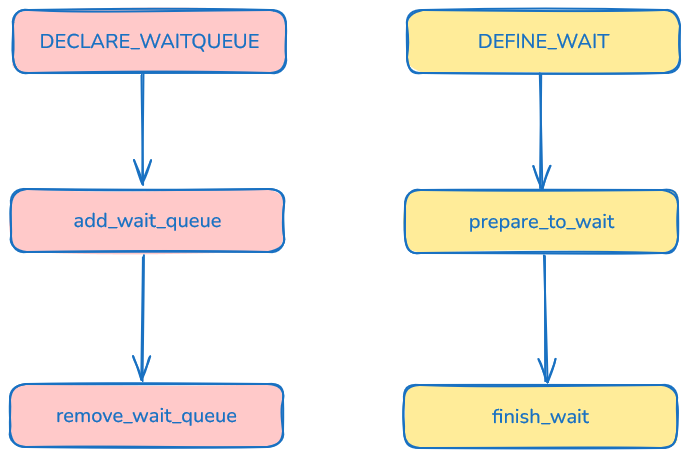
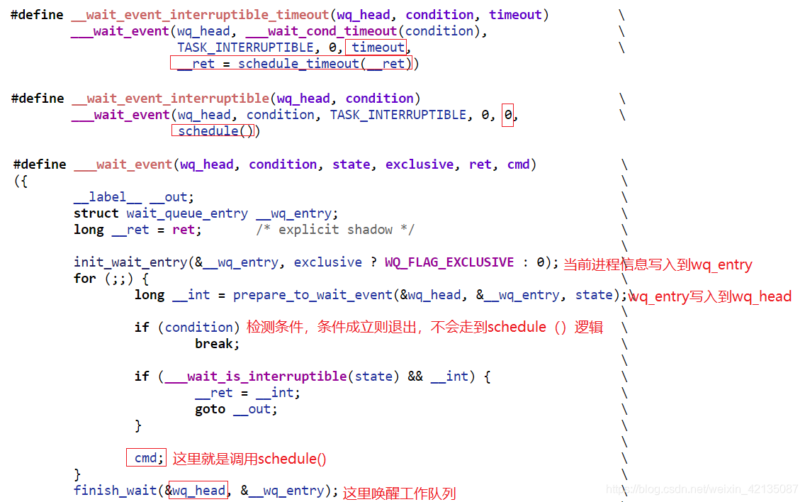

# 等待队列

等待队列是内核中的一种休眠机制，运行中的进程如果需要等待某个事件，可以主动加入等待队列，然后进入休眠状态。当事件发生后，等待队列上的元素被唤醒。

等待队列以循环链表为基础结构，链表头和链表项分别为等待队列头和等待队列元素，用结构体`struct wait_queue_head_t`和`struct wait_queue_entry_t`描述：


```C title="include/linux/wait.h"
/* wait_queue_entry::flags */
#define WQ_FLAG_EXCLUSIVE	0x01
#define WQ_FLAG_WOKEN		0x02
#define WQ_FLAG_BOOKMARK	0x04
#define WQ_FLAG_CUSTOM		0x08
#define WQ_FLAG_DONE		0x10
#define WQ_FLAG_PRIORITY	0x20

/*
 * A single wait-queue entry structure:
 */
struct wait_queue_entry {
	unsigned int		flags;
	void			*private;	//指向task_struct
	wait_queue_func_t	func;	//唤醒时调用的函数
	struct list_head	entry;
};

struct wait_queue_head {
	spinlock_t		lock;
	struct list_head	head;
};

typedef struct wait_queue_head wait_queue_head_t;

typedef struct wait_queue_entry wait_queue_entry_t;

typedef int (*wait_queue_func_t)(struct wait_queue_entry *wq_entry, unsigned mode, int flags, void *key);
int default_wake_function(struct wait_queue_entry *wq_entry, unsigned mode, int flags, void *key);

```

以进程的阻塞与唤醒为例，等待队列的使用场景为：进程 A 因等待某些资源而进入到阻塞状态，便将当前进程加入到等待队列 Q 中。进程 B 在一系列操作后，可通知进程 A 所需资源已到位，便调用`wake up()`函数来唤醒等待队列上 Q 的进程，注意此时所有等待在队列 Q 上的进程均被置为可运行状态。

注意：由于等待队列 Q 上所有的进程都会被唤醒，假如这些进程都在等待某个共享资源，那么在唤醒的过程中会产生激烈的竞争，最后只有一个进程获得资源，而其他进程不得不再次进入睡眠。这在多线程并发的场景下会出现严重的性能问题。内核为了解决该问题，增加了"独占等待"(WQ_FLAG_EXCLUSIVE)标志，带有此标志的等待任务会被添加到队列尾部，并且只会被唤醒第一个任务。其他一些重要标志比如 WQ_FLAG_WOKEN 表示进程已经被唤醒， WA_FLAG_PRIORITY 表示该进程具有高优先级。

## 使用方法

### 初始化

等待队列头的定义和初始化有两种方式：`init_waitqueue_head(&wq_head)`和`DECLARE_WAIT_QUEUE_HEAD(name)`：

```C
#define init_waitqueue_head(wq_head)						\
	do {									\
		static struct lock_class_key __key;				\
										\
		__init_waitqueue_head((wq_head), #wq_head, &__key);		\
	} while (0)

void __init_waitqueue_head(struct wait_queue_head *wq_head, const char *name, struct lock_class_key *key)
{
    spin_lock_init(&wq_head->lock);
    lockdep_set_class_and_name(&wq_head->lock, key, name);
    INIT_LIST_HEAD(&wq_head->head);
}

#define DECLARE_WAIT_QUEUE_HEAD(name) \
	struct wait_queue_head name = __WAIT_QUEUE_HEAD_INITIALIZER(name)

#define __WAIT_QUEUE_HEAD_INITIALIZER(name) {					\
	.lock		= __SPIN_LOCK_UNLOCKED(name.lock),			\
	.head		= LIST_HEAD_INIT(name.head) }
```

等待队列元素的创建可以使用`DECLARE_WAITQUEUE(name, tsk)`，这将定义一个名为 name 的等待队列元素，并将 private 指针指向 tsk，唤醒函数为`default_wake_function()`：

```C
#define DECLARE_WAITQUEUE(name, tsk)						\
	struct wait_queue_entry name = __WAITQUEUE_INITIALIZER(name, tsk)

#define __WAITQUEUE_INITIALIZER(name, tsk) {					\
	.private	= tsk,							\
	.func		= default_wake_function,				\
	.entry		= { NULL, NULL } }
```

也可以使用`DEFINE_WAIT(name)`和`init_wait(&wait)`，这两种方式的默认唤醒函数为`autoremove_wake_function()`：

```C
#define DEFINE_WAIT(name) DEFINE_WAIT_FUNC(name, autoremove_wake_function)

#define DEFINE_WAIT_FUNC(name, function)					\
	struct wait_queue_entry name = {					\
		.private	= current,					\
		.func		= function,					\
		.entry		= LIST_HEAD_INIT((name).entry),			\
	}

#define init_wait(wait)								\
	do {									\
		(wait)->private = current;					\
		(wait)->func = autoremove_wake_function;			\
		INIT_LIST_HEAD(&(wait)->entry);					\
		(wait)->flags = 0;						\
	} while (0)
```

### 添加和移除元素

内核提供了两个函数，用于将等待队列元素添加到等待队列头中：`add_wait_queue()`和`add_wait_queue_exclusive()`。前者将元素添加到队列头，后者将元素添加到队列尾部，并且设置 WQ_FLAG_EXCLUSIVE 标志：

```C
void add_wait_queue(struct wait_queue_head *wq_head, struct wait_queue_entry *wq_entry)
{
    unsigned long flags;

    // 清除WQ_FLAG_EXCLUSIVE标志
    wq_entry->flags &= ~WQ_FLAG_EXCLUSIVE;
    spin_lock_irqsave(&wq_head->lock, flags);
    __add_wait_queue(wq_head, wq_entry);
    spin_unlock_irqrestore(&wq_head->lock, flags);
}   

static inline void __add_wait_queue(struct wait_queue_head *wq_head, struct wait_queue_entry *wq_entry)
{
    list_add(&wq_entry->entry, &wq_head->head);
}

void add_wait_queue_exclusive(struct wait_queue_head *wq_head, struct wait_queue_entry *wq_entry)
{
    unsigned long flags;

    // 设置WQ_FLAG_EXCLUSIVE标志
    wq_entry->flags |= WQ_FLAG_EXCLUSIVE;
    spin_lock_irqsave(&wq_head->lock, flags);
    __add_wait_queue_entry_tail(wq_head, wq_entry);
    spin_unlock_irqrestore(&wq_head->lock, flags);
}

static inline void __add_wait_queue_entry_tail(struct wait_queue_head *wq_head, struct wait_queue_entry *wq_entry)
{
    list_add_tail(&wq_entry->entry, &wq_head->head);
}
```

`remove_wait_queue()`函数用于从等待队列中移除元素：

```C
void remove_wait_queue(struct wait_queue_head *wq_head, struct wait_queue_entry *wq_entry)
{
    unsigned long flags;

    spin_lock_irqsave(&wq_head->lock, flags);
    __remove_wait_queue(wq_head, wq_entry);
    spin_unlock_irqrestore(&wq_head->lock, flags);
}

static inline void
__remove_wait_queue(struct wait_queue_head *wq_head, struct wait_queue_entry *wq_entry)
{
    list_del(&wq_entry->entry);
}
```



## 等待事件

等待事件可以用于实现简单的进程休眠——进程将一直休眠等待直到某个条件成立。内核提供了以下几个函数：

```C
wait_event(wq_head, condition);
wait_event_interruptible(wq_head, condition);
wait_event_timeout(wq_head, condition, timeout);
wait_event_interruptible_timeout(wq_head, condition, timeout);
io_wait_event(wq_head, condition);
```

- condition == 0：休眠
- condition == 1：唤醒

它们都用于将进程加入到等待队列，直到某个事件发生。"interruptible"表示可以被信号唤醒，"timeout"表示等待超时时间。



总结使用等待队列让进程休眠的过程：

- 将当前进程关联的等待队列元素加入到等待队列中
- 设置当前进程状态
- 判断资源是否得到，或者是否捕获信号
- 进程主动让出CPU，进入休眠状态
- 资源满足时，唤醒进程，将其状态设置为TASK_RUNNING，并从等待队列中移除

## 唤醒

`wake_up()`函数用于唤醒等待队列上的进程，它有许多变体：

```C
#define wake_up(x)			__wake_up(x, TASK_NORMAL, 1, NULL)
#define wake_up_nr(x, nr)		__wake_up(x, TASK_NORMAL, nr, NULL)
#define wake_up_all(x)			__wake_up(x, TASK_NORMAL, 0, NULL)
#define wake_up_locked(x)		__wake_up_locked((x), TASK_NORMAL, 1)
#define wake_up_all_locked(x)		__wake_up_locked((x), TASK_NORMAL, 0)

#define wake_up_interruptible(x)	__wake_up(x, TASK_INTERRUPTIBLE, 1, NULL)
#define wake_up_interruptible_nr(x, nr)	__wake_up(x, TASK_INTERRUPTIBLE, nr, NULL)
#define wake_up_interruptible_all(x)	__wake_up(x, TASK_INTERRUPTIBLE, 0, NULL)
#define wake_up_interruptible_sync(x)	__wake_up_sync((x), TASK_INTERRUPTIBLE)
```

`wake_up()`函数会遍历等待队列上的所有元素（包括 TASK_INTERRUPTIBLE 和 TASK_UNINTERRUPTIBLE ），根据 nr_exclusive 参数的要求唤醒进程，同时实现了分批次唤醒工作。最终会回调等待队列元素所绑定的唤醒函数。

唤醒的两种回调函数`default_wake_function()`和`autoremove_wake_function()`的区别是，后者会将进程从等待队列中移除，而前者不会。

## 总结

休眠方式1：

```C
DECLARE_WAIT_QUEUE_HEAD(queue);
DECLARE_WAITQUEUE(wait, current);

for (;;) {
    add_wait_queue(&queue, &wait);
    set_current_state(TASK_INTERRUPTIBLE);
    if (condition)
        break;
    schedule();
    remove_wait_queue(&queue, &wait);
    if (signal_pending(current))
        return -ERESTARTSYS;
}
set_current_state(TASK_RUNNING);
remove_wait_queue(&queue, &wait);
```

休眠方式2：

```C
DELARE_WAIT_QUEUE_HEAD(queue);
DEFINE_WAIT(wait);

while (! condition) {
    prepare_to_wait(&queue, &wait, TASK_INTERRUPTIBLE);
    if (! condition)
        schedule();
    finish_wait(&queue, &wait);
}
```