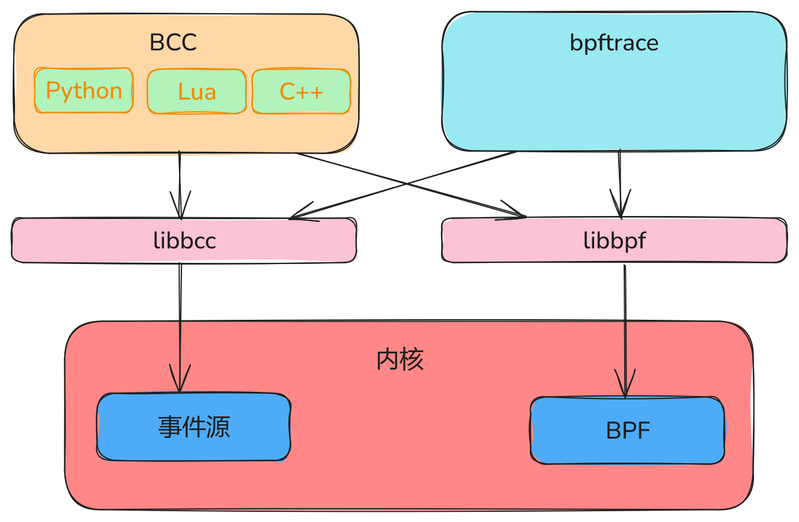

# 性能观测技术概览

Linux 性能观测技术主要分为{==指标观测==}和{==跟踪观测==}。

指标观测是指从系统中获取一个数字化的值，用来展示当前系统的运行情况，比如 CPU 利用率、负载这些都属于指标观测。指标观测只能用于发现问题，但是无法精细地定位问题。跟踪观测是更高级的观测技术，可以收集系统相关活动的信息，从而定位出真正的性能问题。最著名的火焰图就是通过采样的方式，对用户或内核的调用栈进行分析，找出哪些函数消耗了更多的 CPU 周期。
类似的跟踪工具还有`ftrace`、`trace-cmd`，最近流行起来的`eBPF`，以及在其基础上封装的`BCC`、`bpftrace`等工具。

BCC 是最早用于开发 BPF 跟踪程序的高级框架。它提供了一个编写内核 BPF 程序的 C 语言环境，同时还提供了其他高级语言(如Python、Lua和C++)环境来实现用户接口。它也是 libbcc 和 libbpf 库的前身。

bpftrace 是一个新出现的前端工具，它提供了专门用于创建 BPF 工具的高级语言支持。适合编写短小的脚本。



不管是何种工具，都依赖底层提供的事件源。事件源可以分为硬件事件、内核软件事件、内核跟踪和用户跟踪。其中，内核跟踪又分为静态跟踪(tracepoint)、动态跟踪(kprobe)，用户跟踪分为静态跟踪(USDT probe)、动态跟踪(uprobe)。

## 软件事件

`perf`工具可以用来查看当前系统支持的软件事件：

```SHELL
$ perf list sw
List of pre-defined software events(to be used in -e):
  alignment-faults
  context-switches OR cs
  cpu-migrations OR migrations
  emulation-faults
  major-faults OR major_faults
  major-faults
  minor-faults
  page-faults OR faults
  task-clock
```

- `alignment-faults`：发生内存对齐错误的次数。
- `context-switches`：发生上下文切换的次数。
- `cpu-migrations`：发生 CPU 迁移的次数。
- `emulation-faults`：发生模拟错误的次数。
- `page-faults`：发生缺页异常的次数。

## 内核跟踪

跟踪分为静态和动态两种。

## 60秒分析

1. uptime
2. dmesg | tail
3. vmstat 1
4. mpstat -P ALL 1
5. pidstat 1
6. iostat -xz 1
7. free -m
8. sar -n DEV 1
9. sar -n TCP, ETCP 1
10. top