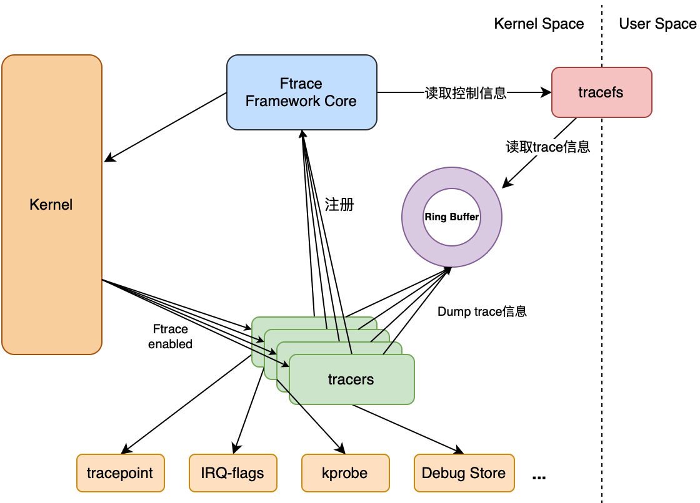

# 静态跟踪

`ftrace`和`perf`工具都可以用来实现静态跟踪。

## ftrace



ftrace 是一个内部跟踪器，用于调试或者分析性能问题。

首先进入到 /sys/kernel/debug/tracing 目录，查看当前支持的跟踪器：

```SHELL
$ cat available_tracers 
timerlat osnoise hwlat blk mmiotrace function_graph wakeup_dl wakeup_rt wakeup function nop
```

其中常用的是`function`和`function_graph`，`function`只显示函数名，而`function_graph`还显示该函数的调用关系。

/events/ 目录列出了可以跟踪的各个模块，进入模块目录，enable 写入1表示打开静态跟踪，然后访问 /tracing/ 目录的`trace_pipe`就可以看到内核打印的日志了。

### 常用配置

| 名称 | 说明 | 
| ---- | ---- |
| available_tracers | 支持的跟踪器，current_tracer必须是这里面支持的跟踪器 |
| available_events | 支持的跟踪事件|
| available_filter_functions | 可跟踪的函数 |
| current_tracer | 当前使用的跟踪器，默认为nop |
| trace | 跟踪结果，用cat查看 |
| tracing_on | 开启或暂停 |
| max_graph_depth | 函数嵌套的最大深度 |
| set_ftrace_filter | 仅追踪特定的函数 |
| set_ftrace_notrace | 忽略特定的函数 |
| set_ftrace_pid | 追踪特定的PID |

### function

function 为函数跟踪器，使用方法如下：

```SHELL
$ echo function > current_tracer
$ echo 1 > tracing_on
$ echo 0 > tracing_on
```

读取日志：

```SHELL
$ cat trace | head -n 30
# tracer: function
#
# entries-in-buffer/entries-written: 82435/3496025   #P:2
#
#                                _-----=> irqs-off
#                               / _----=> need-resched
#                              | / _---=> hardirq/softirq
#                              || / _--=> preempt-depth
#                              ||| / _-=> migrate-disable
#                              |||| /     delay
#           TASK-PID     CPU#  |||||  TIMESTAMP  FUNCTION
#              | |         |   |||||     |         |
          <idle>-0       [000] d.h.. 3975008.322794: enqueue_entity <-enqueue_task_fair
          <idle>-0       [000] d.h.. 3975008.322794: update_curr <-enqueue_entity
          <idle>-0       [000] d.h.. 3975008.322794: __update_load_avg_se <-update_load_avg
          <idle>-0       [000] d.h.. 3975008.322794: __update_load_avg_cfs_rq <-update_load_avg
          <idle>-0       [000] d.h.. 3975008.322795: update_cfs_group <-enqueue_entity
          <idle>-0       [000] d.h.. 3975008.322795: reweight_entity <-update_cfs_group
          <idle>-0       [000] d.h.. 3975008.322795: place_entity <-enqueue_entity
          <idle>-0       [000] d.h.. 3975008.322795: hrtick_update <-enqueue_task_fair
          <idle>-0       [000] d.h.. 3975008.322795: ttwu_do_wakeup <-ttwu_do_activate
          <idle>-0       [000] d.h.. 3975008.322795: check_preempt_curr <-ttwu_do_wakeup
          <idle>-0       [000] d.h.. 3975008.322795: resched_curr <-check_preempt_curr
          <idle>-0       [000] dNh.. 3975008.322796: raw_spin_rq_unlock <-try_to_wake_up
          <idle>-0       [000] dNh.. 3975008.322796: _raw_spin_unlock_irqrestore <-try_to_wake_up
          <idle>-0       [000] dNh.. 3975008.322796: _raw_spin_lock_irq <-__hrtimer_run_queues
          <idle>-0       [000] dNh.. 3975008.322796: __remove_hrtimer <-__hrtimer_run_queues
          <idle>-0       [000] dNh.. 3975008.322796: _raw_spin_unlock_irqrestore <-__hrtimer_run_queues
          <idle>-0       [000] dNh.. 3975008.322796: hrtimer_wakeup <-__hrtimer_run_queues
          <idle>-0       [000] dNh.. 3975008.322796: wake_up_process <-hrtimer_wakeup
```

#### function_graph

function_graph 为函数调用关系跟踪器，使用方法如下：

```SHELL
$ echo function_graph > current_tracer
$ echo 1 > tracing_on
$ echo 0 > tracing_on
```

读取日志：

```SHELL
$ cat trace| head -n 40
# tracer: function_graph
#
# CPU  DURATION                  FUNCTION CALLS
# |     |   |                     |   |   |   |
 1)   0.302 us    |                        } /* __update_load_avg_se */
 1)   0.239 us    |                        __update_load_avg_cfs_rq();
 1)   0.225 us    |                        __update_load_avg_cfs_rq();
 1)   0.251 us    |                        __update_load_avg_se();
 1)   0.243 us    |                        __update_load_avg_cfs_rq();
 1)   0.247 us    |                        __update_load_avg_cfs_rq();
 1)   0.222 us    |                        __update_load_avg_se();
 1)   0.237 us    |                        __update_load_avg_cfs_rq();
 1)   0.304 us    |                        __update_load_avg_cfs_rq();
 1)   0.296 us    |                        __update_load_avg_cfs_rq();
 1)   0.240 us    |                        __update_load_avg_cfs_rq();
 1)   8.942 us    |                      } /* __update_blocked_fair */
 1)   0.221 us    |                      raw_spin_rq_unlock();
 1) + 12.607 us   |                    } /* update_blocked_averages */
 1)               |                    load_balance() {
 1)               |                      find_busiest_group() {
 1)               |                        update_group_capacity() {
 1)   0.371 us    |                          __msecs_to_jiffies();
 1)   0.243 us    |                          update_cpu_capacity();
 1)   1.328 us    |                        }
 1)   0.281 us    |                        idle_cpu();
 1)   0.262 us    |                        update_sd_pick_busiest();
 1)   3.278 us    |                      }
 1)   3.885 us    |                    }
 1)   0.225 us    |                    __msecs_to_jiffies();
 1)   0.219 us    |                    rcu_read_unlock_strict();
 1)               |                    raw_spin_rq_lock_nested() {
 1)   0.214 us    |                      _raw_spin_lock();
 1)   0.615 us    |                    }
 1) + 19.516 us   |                  } /* newidle_balance */
 1) + 19.933 us   |                } /* pick_next_task_fair */
 1)               |                put_prev_task_fair() {
 1)   0.224 us    |                  put_prev_entity();
 1)   0.222 us    |                  put_prev_entity();
 1)   1.190 us    |                }
 1)               |                pick_next_task_idle() {
```


## trace-cmd

使用`ftrace`需要对文件进行频繁的写入和读出，操作起来比较麻烦。而`trace-cmd`是对`ftrace`的封装，使用起来更加方便。

```SHELL
trace-cmd version 2.9.1 (d8edc93bf4a92a4575eb3fb1108fef8030ede48b)

usage:
  trace-cmd [COMMAND] ...

  commands:
     record - record a trace into a trace.dat file
     set - set a ftrace configuration parameter
     start - start tracing without recording into a file
     extract - extract a trace from the kernel
     stop - stop the kernel from recording trace data
     restart - restart the kernel trace data recording
     show - show the contents of the kernel tracing buffer
     reset - disable all kernel tracing and clear the trace buffers
     clear - clear the trace buffers
     report - read out the trace stored in a trace.dat file
     stream - Start tracing and read the output directly
     profile - Start profiling and read the output directly
     hist - show a histogram of the trace.dat information
     stat - show the status of the running tracing (ftrace) system
     split - parse a trace.dat file into smaller file(s)
     options - list the plugin options available for trace-cmd report
     listen - listen on a network socket for trace clients
     agent - listen on a vsocket for trace clients
     setup-guest - create FIFOs for tracing guest VMs
     list - list the available events, plugins or options
     restore - restore a crashed record
     snapshot - take snapshot of running trace
     stack - output, enable or disable kernel stack tracing
     check-events - parse trace event formats
     dump - read out the meta data from a trace file

```

### 使用方法

`trace-cmd`有两种追踪方式：

- `start`和`stop`：记录至ringbuffer中
- `record`和`report`：记录至文件trace.dat，类似于`perf`

显示可被追踪的函数：

```SHELL
$ trace-cmd list -f
```

启用追踪器：

```SHELL
$ trace-cmd start -p function
```

查看输出：

```SHELL
$ trace-cmd show | head -20
```

关闭追踪器：

```SHELL
$ trace-cmd stop
```

清除缓冲区：

```SHELL
$ trace-cmd clear
```

## perf

perf 是一个事件驱动的观测工具，`perf help`列出了所有支持的指令：

```SHELL
$ perf help

 usage: perf [--version] [--help] [OPTIONS] COMMAND [ARGS]

 The most commonly used perf commands are:
   annotate        Read perf.data (created by perf record) and display annotated code
   archive         Create archive with object files with build-ids found in perf.data file
   bench           General framework for benchmark suites
   buildid-cache   Manage build-id cache.
   buildid-list    List the buildids in a perf.data file
   c2c             Shared Data C2C/HITM Analyzer.
   config          Get and set variables in a configuration file.
   daemon          Run record sessions on background
   data            Data file related processing
   diff            Read perf.data files and display the differential profile
   evlist          List the event names in a perf.data file
   ftrace          simple wrapper for kernel's ftrace functionality
   inject          Filter to augment the events stream with additional information
   iostat          Show I/O performance metrics
   kallsyms        Searches running kernel for symbols
   kmem            Tool to trace/measure kernel memory properties
   kvm             Tool to trace/measure kvm guest os
   list            List all symbolic event types
   lock            Analyze lock events
   mem             Profile memory accesses
   record          Run a command and record its profile into perf.data
   report          Read perf.data (created by perf record) and display the profile
   sched           Tool to trace/measure scheduler properties (latencies)
   script          Read perf.data (created by perf record) and display trace output
   stat            Run a command and gather performance counter statistics
   test            Runs sanity tests.
   timechart       Tool to visualize total system behavior during a workload
   top             System profiling tool.
   version         display the version of perf binary
   probe           Define new dynamic tracepoints
   trace           strace inspired tool

 See 'perf help COMMAND' for more information on a specific command.
```

有三种关键的术语在这里先介绍：

- 计数(count)：某个事件发生的次数
- 采样(sample)：收集调用事件的细节
- 追踪(trace)：记录事件发生的过程

`perf stat`可以收集一些计数信息：

```SHELL
$ perf stat
^C
 Performance counter stats for 'system wide':

         10,597.39 msec cpu-clock                 #    2.000 CPUs utilized          
            13,542      context-switches          #    1.278 K/sec                  
             1,205      cpu-migrations            #  113.707 /sec                   
            13,326      page-faults               #    1.257 K/sec                  
   <not supported>      cycles                                                      
   <not supported>      instructions                                                
   <not supported>      branches                                                    
   <not supported>      branch-misses                                               

       5.298707459 seconds time elapsed
```

`perf top`可以直接对系统进行采样：

```
Samples: 25K of event 'cpu-clock:pppH', 4000 Hz, Event count (approx.): 3837575381 lost: 0/0 drop: 0/1045
Overhead  Shared Object                                  Symbol
  16.48%  [kernel]                                       [k] trace_graph_entry                                                           ◆
   7.28%  [kernel]                                       [k] pvclock_clocksource_read                                                    ▒
   4.41%  [kernel]                                       [k] update_blocked_averages                                                     ▒
   4.29%  perf                                           [.] __symbols__insert                                                           ▒
   4.16%  [kernel]                                       [k] finish_task_switch.isra.0                                                   ▒
   3.81%  [kernel]                                       [k] __lock_text_start                                                           ▒
   2.89%  [kernel]                                       [k] function_graph_enter                                                        ▒
   2.45%  perf                                           [.] rb_next                                                                     ▒
   2.03%  [kernel]                                       [k] ftrace_graph_entry_test                                                     ▒
   1.97%  [kernel]                                       [k] hash_contains_ip                                                            ▒
   1.85%  [kernel]                                       [k] ftrace_graph_caller                                                         ▒
   1.59%  perf                                           [.] d_print_comp_inner                                                          ▒
   1.53%  [kernel]                                       [k] ftrace_ops_test                                                             ▒
   1.37%  [kernel]                                       [k] prepare_ftrace_return                                                       ▒
   1.26%  perf                                           [.] rust_demangle_callback                                                      ▒
   0.90%  [kernel]                                       [k] __softirqentry_text_start                                                   ▒
   0.85%  [kernel]                                       [k] ftrace_lookup_ip                                                            ▒
   0.75%  [kernel]                                       [k] __remove_mapping                                                            ▒
   0.71%  perf                                           [.] d_count_templates_scopes                                                    ▒
   0.70%  perf                                           [.] rb_insert_color                                                             ▒
   0.69%  libc.so.6                                      [.] _int_malloc                                                                 ▒
   0.61%  [kernel]                                       [k] shrink_active_list                                                          ▒
   0.61%  perf                                           [.] d_print_comp                                                                ▒
   0.58%  [kernel]                                       [k] do_user_addr_fault                                                          ▒
   0.48%  [kernel]                                       [k] __x86_indirect_thunk_rax                                                    ▒
   0.47%  [kernel]                                       [k] __run_timers.part.0                                                         ▒

```

而`perf record`则是把多个时间段的`perf top`结果保存到一个 perf.data 文件中，可以使用`perf report`来进行分析。

### 事件类型

perf 支持多种事件类型，命令`perf list`列出了所有支持的事件类型，包括：

- Software Events
- Hardware Events
- Tracepoints
- USDT
- Dynamic Tracing
- Timed Profiling


### 火焰图

1. 使用`perf`记录事件

    ```SHELL
    $ perf record -F 100 -a -g -- sleep 60
    $ perf script > out.perf
    ```

2. 折叠栈

    ```SHELL
    $ FlameGraph/stackcollapse-perf.pl out.perf > out.folded
    ```

3. 生成火焰图

    ```SHELL
    $ FlameGraph/flamegraph.pl out.folded > out.svg
    ```

4. 在浏览器中打开

## 跟踪点

静态跟踪，又称跟踪点(tracepoint)，是由内核开发者在内核函数中的特定逻辑位置处放置的，这些跟踪点会被编译到内核的二进制文件中。跟踪点的优势是它的 API 比较稳定，在内核版本升级后一般仍然可以工作。

跟踪点的格式是"子系统：事件名"，比如"kmem:kmalloc"。

跟踪点提供以下两个接口：

- 基于 ftrace：通过 /sys/kernel/tracing/events/ 目录
- `perf_event_open()`：类似于 perf 工具

