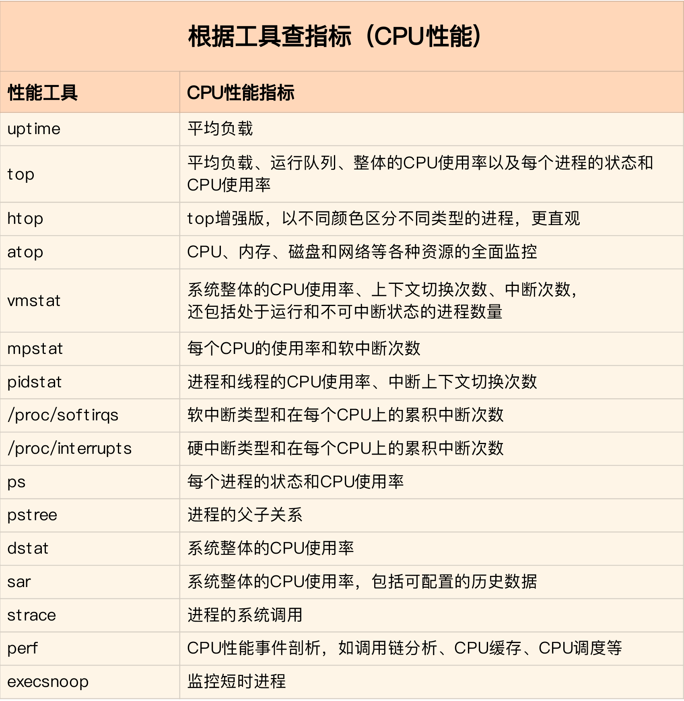

# CPU性能调优


## CPU性能指标

### CPU使用率

CPU使用率，是指单位时间内CPU使用情况的统计，以百分比的方式展示。

与CPU使用率相关的指标有许多：

- user：用户态时间
- nice：低优先级用户态时间
- system：内核态时间
- idle：空闲时间
- iowait：等待I/O完成的时间
- irq：硬中断时间
- softirq：软中断时间
- steal：管理程序时间
- guest：运行虚拟处理器的时间
- guest_nice：低优先级运行虚拟处理器的时间

使用`perf top`实时显示占用CPU时钟最多的函数或者指令：

```SHELL
$ perf top
Samples: 833  of event 'cpu-clock', Event count (approx.): 97742399
Overhead  Shared Object       Symbol
   7.28%  perf                [.] 0x00000000001f78a4
   4.72%  [kernel]            [k] vsnprintf
   4.32%  [kernel]            [k] module_get_kallsym
   3.65%  [kernel]            [k] _raw_spin_unlock_irqrestore
...
```

输出结果的第一行分别代表采样数（Samples）、事件类型（event）、事件计数（Event count）。

下方的表格各列的含义是：

- Overhead：当前函数或者指令占用的CPU时钟百分比
- Shared Object：函数或者指令所在的动态链接库名
- Symbol：函数或者指令名，16进制地址代表未知符号

`perf top`不保存数据，我们可以使用`perf record`和`perf report`命令来记录和分析数据，同时加上-g参数以显示调用关系链。

### 平均负载

每当系统变慢时，我们通常做的第一件事就是执行`top`或者`uptime`命令来了解下系统的负载情况，比如：

```SHELL
$ uptime
02:34:03 up 2 days, 20:14,  1 user,  load average: 0.63, 0.83, 0.88
```

对应的含义是：

```
02:34:03              //当前时间
up 2 days, 20:14      //系统运行时间
1 user                //正在登录用户数
load average: 0.63, 0.83, 0.88  //1分钟、5分钟、15分钟的平均负载
```

什么是平均负载？平均负载是指单位时间内，系统处于可运行状态和不可中断状态的平均进程数，也就是平均活跃进程数，它和CPU使用率并没有直接关系。

所谓可运行状态的进程，是指正在使用CPU或者正在等待CPU的进程，也就是我们使用`ps`命令看到的，处于{==R状态==}（Running或Runnable）的进程。

不可中断状态的进程则是正处于内核态关键流程中的进程，并且这些流程不能被打断。比如最常见的是等待磁盘I/O的进程，也就是我们使用`ps`命令看到的，处于{==D状态==}（Uninterruptible Sleep，也被称为Disk Sleep）的进程。当一个进程向磁盘读写数据时，它需要等待磁盘的回应，在这个过程中是不能被打断的，否则就会出现磁盘和内存数据不一致的情况。

所以平均负载可以简单地理解为是平均活跃进程数，最理想的情况是每个CPU刚好运行一个进程，这时的平均负载就等于CPU的个数。比如在只有2个CPU的系统上，如果平均负载是2，那么意味着所有的CPU都刚好被完全占用；如果平均负载是4，意味着有一半的进程竞争不到CPU。我们可以通过查询/proc/cpuoinfo来获取当前系统有几个CPU。

平均负载有三个值，我们需要综合查看，分析系统负载的趋势：

- 如果这三个值相差不大，说明系统运行平稳。
- 如果1分钟的值远小于15分钟的值，说明系统最近的负载在减少。
- 而反过来，如果1分钟的值远大于15分钟的值，说明系统最近的负载在增加。

平均负载和CPU使用率不一定完全对应，比如：

- CPU密集型进程，使用大量CPU也会导致平均负载升高，此时两者对应。
- I/O密集型进程，等待I/O会导致平均负载升高，但是CPU使用率不一定很高。
- 大量等待CPU的进程调度会导致平均负载升高，此时的CPU使用率也会比较高。

### 上下文切换

众所周知，Linux是一个多任务操作系统，支持远大于其CPU核心数的进程运行。这些进程并非同时运行，而是使用CPU的调度算法轮流执行。在每个任务运行前，CPU需要知道任务从哪里加载、运行，也就是说系统需要提前设置寄存器以及程序计数器的内容，这种环境被称为CPU上下文。

而CPU上下文切换，就是把上一个任务的环境保存起来，然后加载下一个任务的环境。暂时挂起的任务会在未来的某个时间点上继续执行。

由于运行任务的不同，CPU上下文切换也需要根据不同的环境分为不同的场景：

- 进程上下文切换：进程是Linux系统中最基本的执行单元，进程的切换由操作系统内核来完成，这个过程需要保存和恢复进程的各种寄存器状态、内存页等数据，因此，进程的上下文切换开销比较大。
- 线程上下文切换：线程是轻量级的进程，同一进程的多个线程之间是共享进程的上下文的，因此，线程的上下文切换比进程的上下文切换要快得多。
- 中断上下文切换：为了快速响应硬件的事情，一个硬件中断会随时打断进程的正常执行，转而执行中断处理程序。在打断其他进程时，就需要将进程当前的状态保存下来，以便后续恢复。这个过程就叫做中断上下文切换。

对于进程上下文切换这里需要说明一下。一次系统调用涉及到从用户态到内核态，再从内核态到用户态，一共两次CPU上下文切换。

对于一般的进程之间的上下文切换，只有在进程调度的时候才会用到。Linux为每个CPU都维护了一个就绪队列，将活跃进程（正在运行和等待运行的进程）按照优先级和等待时间排序，然后选择最需要CPU的进程，更详细的介绍请看[进程调度](../kernel/sched.md)。进程在以下场景中，会触发进程调度：

- 分配个进程的时间片耗尽。
- 进程在等待某个资源。
- 进程调用`sleep()`等函数主动挂起。
- 更高优先级的进程需要运行。
- 发生硬件中断。

上下文切换是衡量性能的一个重要指标，它可以是自愿的，也可以是非自愿的：

- 自愿上下文切换变多了，说明进程都在等待资源，可能发生了I/O问题。
- 非自愿上下文切换变多了，说明进程都在被强制调度，可能发生了CPU竞争问题。


### CPU缓存命中率

CPU具有L1、L2、L3三级缓存，其中L3是共享的。从L1到L3，缓存的大小依次增加，但是性能依次降低。它们的命中率，衡量的是CPU缓存的复用情况。

## CPU性能分析工具



其中`top`、`vmstat`、`pidstat`几乎涵盖了所有重要的CPU性能指标。

使用`top`命令动态监测CPU：

```SHELL
$ top
  PID USER      PR  NI    VIRT    RES    SHR S  %CPU %MEM     TIME+ COMMAND
28961 root      20   0   43816   3148   4040 R   3.2  0.0   0:00.01 top
  620 root      20   0   37280  33676    908 D   0.3  0.4   0:00.01 app
    1 root      20   0  160072   9416   6752 S   0.0  0.1   0:37.64 systemd
 1896 root      20   0       0      0      0 Z   0.0  0.0   0:00.00 devapp
    2 root      20   0       0      0      0 S   0.0  0.0   0:00.10 kthreadd
    4 root       0 -20       0      0      0 I   0.0  0.0   0:00.00 kworker/0:0H
    6 root       0 -20       0      0      0 I   0.0  0.0   0:00.00 mm_percpu_wq
    7 root      20   0       0      0      0 S   0.0  0.0   0:06.37 ksoftirqd/0
...
```

- 使用`uptime`查看系统平均负载：

```SHELL
$ uptime
02:34:03 up 2 days, 20:14,  1 user,  load average: 0.63, 0.83, 0.88
```

- 使用`mpstat`查看CPU使用率：

```SEHLL
# -P ALL 表示监控所有CPU，后面数字5表示间隔5秒后输出一组数据
$ mpstat -P ALL 5
Linux 4.15.0 (ubuntu) 09/22/18 _x86_64_ (2 CPU)
13:30:06     CPU    %usr   %nice    %sys %iowait    %irq   %soft  %steal  %guest  %gnice   %idle
13:30:11     all   50.05    0.00    0.00    0.00    0.00    0.00    0.00    0.00    0.00   49.95
13:30:11       0    0.00    0.00    0.00    0.00    0.00    0.00    0.00    0.00    0.00  100.00
13:30:11       1  100.00    0.00    0.00    0.00    0.00    0.00    0.00    0.00    0.00    0.00
```

- 使用`pidstat`查看进程的CPU使用率：

```SHELL
# 间隔5秒后输出一组数据
$ pidstat -u 5 1
13:37:07      UID       PID    %usr %system  %guest   %wait    %CPU   CPU  Command
13:37:12        0      2962  100.00    0.00    0.00    0.00  100.00     1  stress
```

- 使用`vmstat`查看上下文切换情况：

```SHELL
# 每隔5秒输出1组数据
$ vmstat 5
procs -----------memory---------- ---swap-- -----io---- -system-- ------cpu-----
 r  b   swpd   free   buff  cache   si   so    bi    bo   in   cs us sy id wa st
 0  0      0 7005360  91564 818900    0    0     0     0   25   33  0  0 100  0  0
```

> cs：每秒上下文切换次数。

> in：每秒中断次数。

> r：就绪队列长度。

> b：等待资源的进程数。

- 使用`pidstat`查看每个进程上下文切换情况：

```SHELL
# 每隔5秒输出1组数据
$ pidstat -w 5
Linux 4.15.0 (ubuntu)  09/23/18  _x86_64_  (2 CPU)

08:18:26      UID       PID   cswch/s nvcswch/s  Command
08:18:31        0         1      0.20      0.00  systemd
08:18:31        0         8      5.40      0.00  rcu_sched
...
```

> cswch/s：每秒自愿上下文切换次数。

> nvcswch/s：每秒非自愿上下文切换次数。

- 使用`dstat`查看CPU和I/O使用情况：

```SHELL
# 间隔1秒输出10组数据
$ dstat 1 10
You did not select any stats, using -cdngy by default.
--total-cpu-usage-- -dsk/total- -net/total- ---paging-- ---system--
usr sys idl wai stl| read  writ| recv  send|  in   out | int   csw
  0   0  96   4   0|1219k  408k|   0     0 |   0     0 |  42   885
  0   0   2  98   0|  34M    0 | 198B  790B|   0     0 |  42   138
  0   0   0 100   0|  34M    0 |  66B  342B|   0     0 |  42   135
  0   0  84  16   0|5633k    0 |  66B  342B|   0     0 |  52   177
  0   3  39  58   0|  22M    0 |  66B  342B|   0     0 |  43   144
  0   0   0 100   0|  34M    0 | 200B  450B|   0     0 |  46   147
  0   0   2  98   0|  34M    0 |  66B  342B|   0     0 |  45   134
  0   0   0 100   0|  34M    0 |  66B  342B|   0     0 |  39   131
  0   0  83  17   0|5633k    0 |  66B  342B|   0     0 |  46   168
  0   3  39  59   0|  22M    0 |  66B  342B|   0     0 |  37   134
...
```

- 使用`sar`查看系统的网络收发情况：

```SHELL
# -n DEV 表示显示网络收发的报告，间隔1秒输出一组数据
$ sar -n DEV 1
15:03:46        IFACE   rxpck/s   txpck/s    rxkB/s    txkB/s   rxcmp/s   txcmp/s  rxmcst/s   %ifutil
15:03:47         eth0  12607.00   6304.00    664.86    358.11      0.00      0.00      0.00      0.01
15:03:47      docker0   6302.00  12604.00    270.79    664.66      0.00      0.00      0.00      0.00
15:03:47           lo      0.00      0.00      0.00      0.00      0.00      0.00      0.00      0.00
15:03:47    veth9f6bbcd   6302.00  12604.00    356.95    664.66      0.00      0.00      0.00      0.05
```

> IFACE：网卡

> rxpck/txpck：每秒接收与发送的数据包

> rxkB/txkB：每秒接收与发送的千字节

> rxcmp/txcmp：每秒接收与发送的压缩数据包

> rxmcst/txmcst：每秒接收与发送的多播数据包

> %ifutil：网络接口的使用率

- 使用`tcpdump`抓取网络包：

```SHELL
# -i eth0 只抓取eth0网卡，-n不解析协议名和主机名
# tcp port 80表示只抓取tcp协议并且端口号为80的网络帧
$ tcpdump -i eth0 -n tcp port 80
15:11:32.678966 IP 192.168.0.2.18238 > 192.168.0.30.80: Flags [S], seq 458303614, win 512, length 0
...
```


