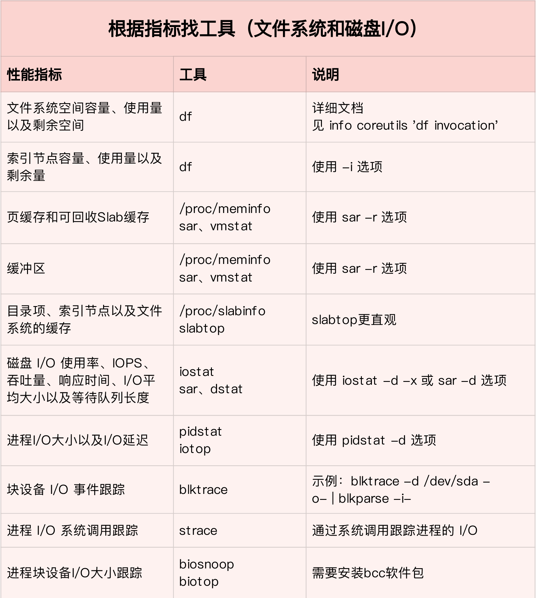
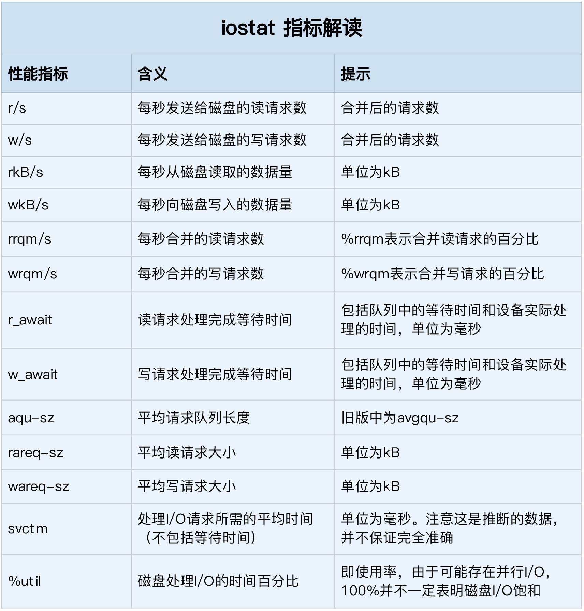

# 磁盘I/O性能调优



## 磁盘性能指标

- 使用率：磁盘处理I/O的时间百分比。
- 饱和度：磁盘处理I/O的繁忙程度。
- IOPS：每秒的I/O请求数。
- 吞吐量：每秒的I/O请求数据量。
- 响应时间：I/O请求从发出到收到响应的间隔时间。

## 磁盘性能分析工具


- 使用`iostat`观察磁盘I/O使用情况：

```SHELL
# -d -x表示显示所有磁盘I/O的指标
$ iostat -d -x 1 
Device            r/s     w/s     rkB/s     wkB/s   rrqm/s   wrqm/s  %rrqm  %wrqm r_await w_await aqu-sz rareq-sz wareq-sz  svctm  %util 
loop0            0.00    0.00      0.00      0.00     0.00     0.00   0.00   0.00    0.00    0.00   0.00     0.00     0.00   0.00   0.00 
loop1            0.00    0.00      0.00      0.00     0.00     0.00   0.00   0.00    0.00    0.00   0.00     0.00     0.00   0.00   0.00 
sda              0.00    0.00      0.00      0.00     0.00     0.00   0.00   0.00    0.00    0.00   0.00     0.00     0.00   0.00   0.00 
sdb              0.00    0.00      0.00      0.00     0.00     0.00   0.00   0.00    0.00    0.00   0.00     0.00     0.00   0.00   0.00 
```



- 使用`pidstat`观察进程I/O使用情况：

```SHELL
$ pidstat -d 1 
13:39:51      UID       PID   kB_rd/s   kB_wr/s kB_ccwr/s iodelay  Command 
13:39:52      102       916      0.00      4.00      0.00       0  rsyslogd
```

- 使用`iotop`对进程I/O排序：

```SHELL
$ iotop
Total DISK READ :       0.00 B/s | Total DISK WRITE :       7.85 K/s 
Actual DISK READ:       0.00 B/s | Actual DISK WRITE:       0.00 B/s 
  TID  PRIO  USER     DISK READ  DISK WRITE  SWAPIN     IO>    COMMAND 
15055 be/3 root        0.00 B/s    7.85 K/s  0.00 %  0.00 % systemd-journald 
```

- 使用`filetop`跟踪文件的读写情况：

```SHELL
# -C 选项表示输出新内容时不清空屏幕 
$ ./filetop -C 

TID    COMM             READS  WRITES R_Kb    W_Kb    T FILE 
514    python           0      1      0       2832    R 669.txt 
514    python           0      1      0       2490    R 667.txt 
514    python           0      1      0       2685    R 671.txt 
514    python           0      1      0       2392    R 670.txt 
514    python           0      1      0       2050    R 672.txt 

...

TID    COMM             READS  WRITES R_Kb    W_Kb    T FILE 
514    python           2      0      5957    0       R 651.txt 
514    python           2      0      5371    0       R 112.txt 
514    python           2      0      4785    0       R 861.txt 
514    python           2      0      4736    0       R 213.txt 
514    python           2      0      4443    0       R 45.txt 
```


