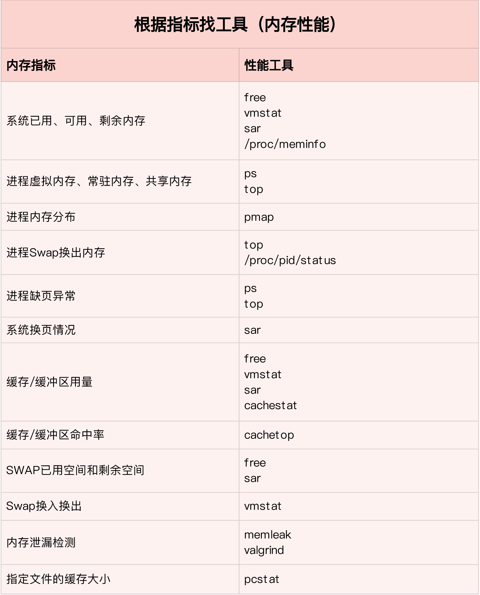

# 内存性能调优



## 内存性能指标

### Free/Available

系统从上电到引导完成，firmware/BIOS要占用一部分内存，内核占用一部分内存，还有一些保留的内存，剩下的就是MemTotal。

MemFree表示系统空闲的内存。除开空闲内存外，系统中还有一些内存经过回收以后也可以释放出来，这两部分加起来就是MemAvailable。

### Buffer/Cache

Buffer和Cache被设计用来提升系统I/O的性能，它们缓存在内存中，充当起慢速磁盘与快速CPU之间的桥梁。

- Buffer是对{==磁盘数据==}的缓存，通常不会特别大。

- Cached是对{==文件数据==}的缓存。

不论是读还是写，应用程序都优先从缓存中读取，这样可以避免访问低速的磁盘，从而提高系统的I/O性能。

## 内存性能分析工具


- 使用`free`查看系统内存使用情况：

```SHELL
$ free
              total        used        free      shared  buff/cache   available
Mem:        8169348      263524     6875352         668     1030472     7611064
Swap:             0           0           0
```

> total：操作系统可以管理的总内存大小

> used：已经使用的内存大小，包括实际使用的内存和buffer以及cache

> free：空闲的内存大小

> shared：多个进程共享的内存大小

> buff/cache：磁盘缓存和文件缓存的大小

> available：可用的内存大小，即系统最大可以压榨的内存余量

> swap：交换分区的内存使用情况

- 使用`top`查看进程内存使用情况：
  
```SHELL
$ top
...
KiB Mem :  8169348 total,  6871440 free,   267096 used,  1030812 buff/cache
KiB Swap:        0 total,        0 free,        0 used.  7607492 avail Mem


  PID USER      PR  NI    VIRT    RES    SHR S  %CPU %MEM     TIME+ COMMAND
  430 root      19  -1  122360  35588  23748 S   0.0  0.4   0:32.17 systemd-journal
 1075 root      20   0  771860  22744  11368 S   0.0  0.3   0:38.89 snapd
 1048 root      20   0  170904  17292   9488 S   0.0  0.2   0:00.24 networkd-dispat
    1 root      20   0   78020   9156   6644 S   0.0  0.1   0:22.92 systemd
12376 azure     20   0   76632   7456   6420 S   0.0  0.1   0:00.01 systemd
12374 root      20   0  107984   7312   6304 S   0.0  0.1   0:00.00 sshd
...
```

> VIRT：进程使用的虚拟内存大小，申请过但尚未分配物理内存也会计算在内。

> RES：进程实际使用的物理内存大小。

> SHR：进程使用的共享内存大小，比如进程间通信。

> %MEM：进程使用的物理内存占系统总内存的百分比。


- 使用`cachestat`和`cachetop`查看缓存命中情况：

这两个工具是bcc软件包的一部分，基于ebpf技术。

```SHELL
$ cachestat 1 3
   TOTAL   MISSES     HITS  DIRTIES   BUFFERS_MB  CACHED_MB
       2        0        2        1           17        279
       2        0        2        1           17        279
       2        0        2        1           17        279 
```

> TOTAL：总缓存次数。

> MISSES：缓存未命中的次数。

> HITS：缓存命中的次数。

> DIRTIES：缓存中dirty pages脏页）的次数。

> BUFFERS_MB：缓存Buffers的大小，单位是MB。

> CACHED_MB：缓存中Cache的数量，单位是MB。


```SHELL
$ cachetop
11:58:50 Buffers MB: 258 / Cached MB: 347 / Sort: HITS / Order: ascending
PID      UID      CMD              HITS     MISSES   DIRTIES  READ_HIT%  WRITE_HIT%
   13029 root     python                  1        0        0     100.0%       0.0%
```

> READ_HIT：读缓存命中率。

> WRITE_HIT：写缓存命中率。

- 使用`smem`将进程按照swap使用量排序：

```SHELL
$ smem --sort swap
  PID User     Command                         Swap      USS      PSS      RSS 
1168907 ubuntu   bash                               0      468     1091     3576 
1169141 ubuntu   /bin/bash --init-file /home        0     1060     1693     4416 
1207585 ubuntu   sleep 180                          0      120      268     1916 
1208733 ubuntu   /usr/bin/python3 /usr/bin/s        0    10908    11197    13956 
1784762 ubuntu   /bin/bash --init-file /home        0      976     1038     3104 
2002992 ubuntu   /lib/systemd/systemd --user        0     2052     2620     6248 
2003004 ubuntu   /usr/libexec/tracker-miner-        0    10288    10768    16148 
2003010 ubuntu   /usr/bin/dbus-daemon --sess        0      776      903     3868
...
```

- 使用`sar`查看内存各指标变化情况：

```SHELL
# 间隔1秒输出一组数据
# -r表示显示内存使用情况，-S表示显示Swap使用情况
$ sar -r -S 1
04:39:56    kbmemfree   kbavail kbmemused  %memused kbbuffers  kbcached  kbcommit   %commit  kbactive   kbinact   kbdirty
04:39:57      6249676   6839824   1919632     23.50    740512     67316   1691736     10.22    815156    841868         4

04:39:56    kbswpfree kbswpused  %swpused  kbswpcad   %swpcad
04:39:57      8388604         0      0.00         0      0.00

04:39:57    kbmemfree   kbavail kbmemused  %memused kbbuffers  kbcached  kbcommit   %commit  kbactive   kbinact   kbdirty
04:39:58      6184472   6807064   1984836     24.30    772768     67380   1691736     10.22    847932    874224        20

04:39:57    kbswpfree kbswpused  %swpused  kbswpcad   %swpcad
04:39:58      8388604         0      0.00         0      0.00

…


04:44:06    kbmemfree   kbavail kbmemused  %memused kbbuffers  kbcached  kbcommit   %commit  kbactive   kbinact   kbdirty
04:44:07       152780   6525716   8016528     98.13   6530440     51316   1691736     10.22    867124   6869332         0

04:44:06    kbswpfree kbswpused  %swpused  kbswpcad   %swpcad
04:44:07      8384508      4096      0.05        52      1.27
```


