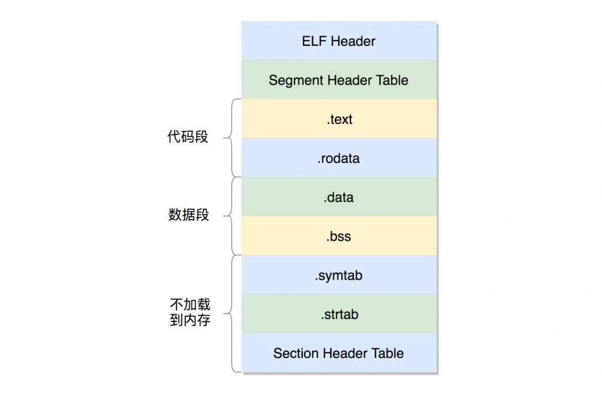

# 从代码到可执行文件

## gcc编译步骤

## 程序的链接与装载

### 程序的二进制格式

经过预处理、编译、汇编以后，.c文件被编译成了.o文件，又叫可重定位文件，这是ELF格式的一种。这个文件格式是这样的。

其中ELF Header记录一个个section的信息，我们可以使用readelf -h查看一个.o文件的Header信息。这个二进制文件里存放着程序的代码以及变量等等信息。

.text：存放编译好的二进制代码。

.rodata：存放只读数据，比如字符串常量。

.data：存放已经初始化的全局变量和静态变量。

.bss：存放未初始化的全局变量和静态变量，全部置为0.

.symtab：符号表，存放的是函数和变量的符号信息。

.rel.text，.rel.data：存放需要重定位的函数和变量。

.strtab：字符串表，比如函数名、变量名。

这些section的数据信息保存在Section Header Table里。为什么叫可重定位文件，因为编译成.o文件的时候，使用了一些外部函数或者变量，此时并不知道这些函数或变量在内存中的位置，所以需要在.o文件中说明这些符号将来是需要重新定位的。

### 静态库与动态库

我们可以将一个个.o文件打包成库文件的形式，供其他程序调用。形成的二进制格式叫可执行文件，是ELF文件的第二种形式。它的结构如下。

这个格式与可重定位文件类似，只不过在链接的过程中，部分section合并了。比如都是二进制代码，那就一起合并到.text段中去。小的section合并成为了大的segment。在ELF头里面，有个叫e_entry的虚拟地址，是程序的入口地址。当静态库与其他程序链接在一起时，会把静态库的信息合并进去，形成一个更大的可执行文件，这样的好处就是该程序就不依赖与静态库文件了。坏处就是有其他需要链接的文件，同样会复制一份信息到内存。而静态库更新后，如果不重新进行编译，程序就无法运行了。所以就有了动态库。动态库也是ELF文件的第三种形式，共享对象文件。

当动态库被链接到程序中去时，只保留对动态库的引用，并且一个动态库可以被多个程序引用。而为了在运行时确定函数位置，基于动态库链接的.so文件多了一些信息。首先是一个叫.interp的段，这里面是ld-linux.so，这是动态链接器，运行时的链接动作都是它做的。另外还多了两个section，一个是.plt，过程链接表，一个是.got，全局偏移量表。假设我们有一个函数func()需要重定位，由于代码段是不可写的，所以在链接过程中，无法将其实际地址写入。解决办法是用了一个小技巧，在汇编指令中，当执行到func()函数时，告诉程序你要去PLT[x]位置处去寻找func函数的位置。而PLT[X]又告诉程序你要去GOT[Y]的地方去找函数位置。当第一次执行时，GOT[Y]里的位置信息是空的，于是GOT告诉PLT，我这里没有定位信息。PLT收到这个信息之后，调用PLT[0]，PLT[0]转而调用GOT[2]，这里面保存的是链接器的入口地址。链接器会找到func函数的入口地址，然后把这个地址写入到GOT[Y]中，下次再调用func函数时，就确定了函数地址。

### 程序的装载

通过execv系统调用，执行load_elf_binary()函数，将可执行文件装载到内存中。

具体实现细节待定。