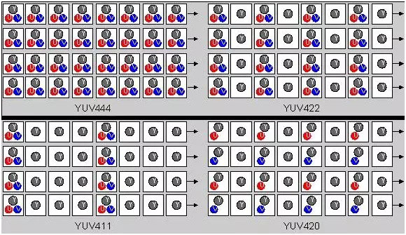

# 音视频基础

视频是利用人眼视觉暂留的原理，通过播放一系列的图片，使人眼产生运动的感觉。单纯传输视频画面，视频量非常大，对现有的网络和存储来说是不可接受的。为了能够使视频便于传输和存储，人们发现视频有大量重复的信息，如果将重复信息在发送端去掉，在接收端恢复出来，这样就大大减少了视频数据的文件，因此有了H.264视频压缩标准。视频里边的原始图像数据会采用 H.264编码格式进行压缩，音频采样数据会采用 AAC 编码格式进行压缩。视频内容经过编码压缩后，确实有利于存储和传输。不过当要观看播放时，相应地也需要解码过程。因此编码和解码之间，显然需要约定一种编码器和解码器都可以理解的约定。就视频图像编码和解码而言，这种约定很简单:

编码器将多张图像进行编码后生产成一段一段的 GOP(Group of Pictures)，解码器在播放时则是读取一段一段的 GOP 进行解码后读取画面再渲染显示。GOP(Group of Pictures)是一组连续的画面，由一张 I 帧和数张 B/P帧组成，是视频图像编码器和解码器存取的基本单位，它的排列顺序将会一直重复到影像结束。I 帧是内部编码帧(也称为关键帧)，P 帧是前向预测帧(前向参考帧)，B 帧是双向内插帧(双向参考帧)。简单地讲, I 帧是一个完整的画面，而P帧和 B帧记录的是相对于 I 帧的变化。如果没有ㄧ帧，P 帧和 B 帧就无法解码。在H.264压缩标准中 I 帧、P帧、B帧用于表示传输的视频画面。

## YUV图像

YUV和RGB的功能类似，都是用来表示图像色彩的。但是对于 YUV 所表示的图像，Y 和 UV 分量是分离的。如果只有 Y 分量而没有 UV 分离，那么图像表示的就是黑白图像。彩色电视机采用的就是 YUV 图像，解决与和黑白电视机的兼容问题，使黑白电视机也能接受彩色电视信号。
YUV不像RGB那样要求三个独立的视频信号同时传输，所以用YUV方式传送占用极少的频宽。因此RGB用于渲染，YUV用于传输。

### YUV采样

YUV有三种采样方式：YUV444，YUV422，YUV420

- YUV444：逐点采样，每个像素包含完整的 Y、U、V 分量
- YUV422：U、V在垂直方向逐点采样，但是在水平方向2:1采样
- YUV420：在水平和垂直方向都按照2:1采样

 

在实际应用中，YUV420格式由于其较高的压缩比和相对较小的文件大小，在数字视频和图像压缩中非常流行。它是MPEG、H.264、H.265等视频压缩标准的基础，也是许多视频文件格式（如MP4、AVI）和流媒体传输中常用的格式。YUV420格式的流行也得益于其相对于人眼对亮度信息比对色度信息更敏感的特性，因此在一定程度上减少色度信息的分辨率对视觉质量的影响较小。

### YUV存储格式

 YUV存储格式分为三种：

 - packed：打包格式，每次都存储一个 YUV
 - planar：平面格式，先存储 Y 平面，再存储 U 平面，最后存储 V 平面，YUV 分量存储在不同的平面
 - semi-planar：半平面格式，先存储 Y 平面，再存储 UV 平面，UV 交错排列在一个平面

## 帧(frame)

视频是由一系列连续的图像组成的，称为帧。每一帧都包含一张完整的图像。帧率指的是视频每秒钟显示的帧数，通常用FPS（Frames Per Second）表示。帧率越高，视频越流畅，但数据量也越大。帧的分辨率是指帧中包含的像素数量，通常以宽度x高度表示，例如1920x1080（1080p），3840x2160（4K）等。

在视频编码中，帧分为I帧、P帧和B帧：

1. I帧（Intra Frame）：
   - 独立编码的帧，不依赖于其他帧
   - 包含完整的图像数据，因此解码器可以单独解码I帧并重建图像
   - 数据量较大
   - 通常用于随机访问点，例如视频的起始点或用户快进/快退到某个位置时的关键帧。
2. P帧（Predictive Frame）：
   - 依赖前面的I帧或P帧进行解码
   - 通过存储与前一帧的差异来减少数据量
   - 压缩率较高，数据量较小

3. B帧（Bidirectional Predictive Frame）：
   - 依赖前面的和后面的I帧或P帧进行解码
   - 通过存储与前后帧的差异来减少数据量
   - 压缩率最高，数据量最小

这些帧类型的组合使得视频编码器能够在保持图像质量的同时，显著减少视频数据量，从而实现高效的视频压缩和传输。在典型的视频编码序列中，通常会以I帧开始，随后是若干P帧和B帧，以实现平衡的压缩效果和解码效率。

## 流(stream)

流是一系列连续传输的数据，通常用于实时传输音频和视频。流可以是单一类型的数据（如音频流或视频流），也可以是多种数据的组合(如音视频流)。流用于实时传输音频、视频等数据，通过网络或其他传输介质，将数据从发送端传输到接收端。