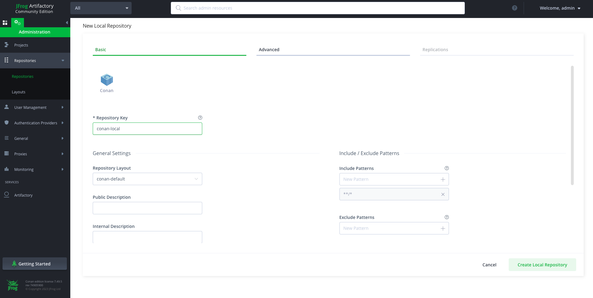

# Conan

Conan 是一个 C/C++ 的包管理器，支持多个平台和构建系统，目前已经更新到了 2.3.0 版本，官方文档：https://docs.conan.io/2/index.html。

​Conan 的特点有：

- 与原生的依赖系统解耦，不引入额外负担
- 兼容多种构建系统，包括 CMake、Visual Studio、Bazel、Meson等
- 统一的包管理方式(中心仓库)
- 支持交叉编译环境
- 自动查找包的依赖关系

Conan 的设计理念与 git 非常类似，用一个中心仓库存储所有的包，用户从仓库拉取或者上传包，而编译则放在本地执行。官方仓库地址为：[Conan Center](https://conan.io/center)，企业用户也可以部署自己的私有仓库。

## 常用命令


## 使用包

### Profile

> Conan profiles allow users to set a complete configuration set for settings, options, environment variables (for build time and runtime context), tool requirements, and configuration variables in a file.

在使用 conan 管理包之前，必须先配置 profile 文件。`conan profile detect`用来生成当前环境的默认配置文件：

```SHELL
$ conan profile show

Host profile:
[settings]
arch=x86_64
build_type=Release
compiler=gcc
compiler.cppstd=gnu17
compiler.libcxx=libstdc++11
compiler.version=11
os=Linux

Build profile:
[settings]
arch=x86_64
build_type=Release
compiler=gcc
compiler.cppstd=gnu17
compiler.libcxx=libstdc++11
compiler.version=11
os=Linux
```

与 profile 相关的命令有：

```SHELL
$ conan profile -h

detect              Generate a profile using auto-detected values.
list                List all profiles in the cache.
path                Show profile path location.
show                Show aggregated profiles from the passed arguments.
```

### 交叉编译

`conan install`命令可以指定 profile 文件，例如：`conan install . -pr:b=default -pr:h=raspberry`。这条命令告诉 conan 交叉编译的配置：default 用于编译环境，raspberry 用于执行环境。

```SHELL
[settings]
os=Linux
arch=aarch64
compiler=gcc
build_type=Release
compiler.cppstd=gnu14
compiler.libcxx=libstdc++11
compiler.version=9

[buildenv]
CC=arm-linux-gnueabihf-gcc-9
CXX=arm-linux-gnueabihf-g++-9
LD=arm-linux-gnueabihf-ld
```

### conanfile.py

`conanfile.py`是 conan 的核心文件，一个简单的示例文件如下：

```python
from conan import ConanFile
from conan.tools.cmake import cmake_layout

class MyFile(ConanFile):
    settings = "os", "compiler", "build_type", "arch"
    generators = "CMakeToolchain", "CMakeDeps"
    
    def requirements(self):
        self.requires("zlib/1.2.11")
    
    def build_requirements(self):
        self.tool_requires("cmake/3.22.6")
    
    # using cmake layout
    def layout(self):
        cmake_layout(self)
```

- `setttings`：整个项目的编译环境，比如编译器、操作系统、架构等
- `generators`：指定生成器，比如 CMakeToolchain、CMakeDeps
- `requirements`：依赖的库，比如 zlib
- `build_requirements`：构建工具，比如 cmake
- `layout`：指定生成的目录结构，这里使用 cmake 布局

## 创建包


## 部署私有仓库

如果企业想要自己管理所有包，那么可以部署企业私有仓库。Conan 官方建议选择使用 Artifactory 作为私有仓库，它的下载地址是：https://conan.io/downloads。你也可以使用 docker 命令一键启动：`docker run --name artifactory -d -p 8081:8081 -p 8082:8082 releases-docker.jfrog.io/jfrog/artifactory-cpp-ce:7.63.12`。

启动 docker 后，登录到默认的 `http://localhost:8081`界面，默认用户名和密码为 admin: password。其界面如下所示：



然后，你需要在页面中创建新的 repository，再将 Artifactory 仓库的地址添加到 conan 中：

```SHELL
conan remote add artifactory http://localhost:8081/artifactory/api/conan/conan-local
```

此时再查看远程仓库，发现多了一个 artifactory 仓库：

```SHELL
$ conan remote list

conancenter: https://center.conan.io [Verify SSL: True, Enabled: True]
artifactory: http://localhost:8081/artifactory/api/conan/conan-local [Verify SSL: True, Enabled: True]
```

配置登录信息：

```SHELL
conan remote login artifactory <user> -p <password>
```

现在，你可以通过 `conan upload` 命令上传自己的包到 artifactory 仓库：

```SHELL
$ conan upload mylib/1.0@user/testing -r artifactory
```

## 版本控制

## 其他重要概念


