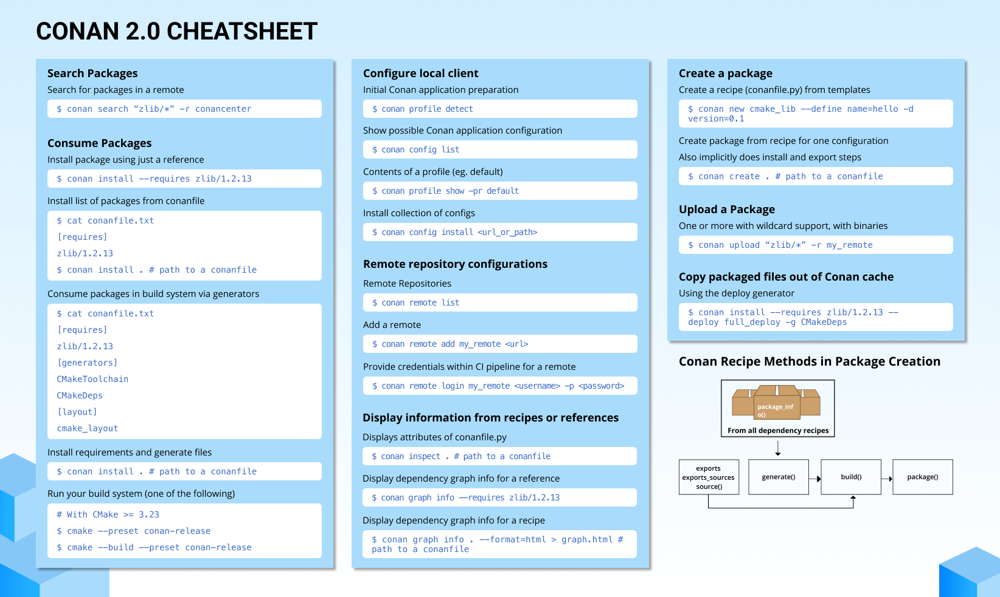

# Conan

Conan是一个C/C++的包管理器，支持多个平台和构建系统。它是专门为加速C和C++项目的开发和持续集成而设计和优化的。通过完整的二进制管理，它可以为任意数量的不同版本的软件包创建和重用任意数量的不同二进制文件（针对不同的配置，如体系结构、编译器版本等），在所有平台上使用完全相同的过程。由于它是分散的，所以很容易运行自己的服务器来私自托管自己的包和二进制文件，而无需共享它们。免费的 JFrog Artifactory Community Edition (CE) 是推荐的Conan服务器，可以在您的控制下私自托管您自己的包。​Conan的特点有：

- 不侵入到原生的构建系统，不引入额外依赖
- 兼容多种构建系统，cmake、xmake、scons等
- 规范的包管理格式
- 自动适配多种平台和环境
- 自动查找包的依赖关系
- 在编译前就能检查出依赖冲突

```SHELL
$ conan --version
Conan versoin 2.3.0
```

Conan的设计理念与git类似，采用分布式架构。服务端负责包的存储，客户端从服务端获取或上传包，然后在本地编译。Conan提供官方仓库[Conan Center](https://conan.io/center)，用户也可以添加自己的仓库。

Conan中的包由一个"conanfile.py"定义。该文件定义了包的依赖、包含的源码、以及如何从源码构建出二进制文件。一个包的"conanfile.py"配置可以生成任意数量的二进制文件，每个二进制可以面向不同的平台和配置（操作系统、体系结构、编译器、以及构件类型等等）。

## Profile

> Conan profiles allow users to set a complete configuration set for settings, options, environment variables (for build time and runtime context), tool requirements, and configuration variables in a file.

你可以使用`conan profile detect`生成当前环境的默认配置文件。

与profile相关的命令有：

```SHELL
$conan profile -h

detect              Generate a profile using auto-detected values.
list                List all profiles in the cache.
path                Show profile path location.
show                Show aggregated profiles from the passed arguments.
```

注意：使用`conan install`命令时可选择系统中的profile配置，如不指定等同于`--profile=default`。

### 交叉编译

可以配置用于交叉编译的profile，并且在调用`conan install`命令时指定`--profile:build`和`--profile:host`参数。

一种可能的交叉编译的profile如下所示：

```SHELL
[settings]
os=Linux
arch=aarch64
compiler=gcc
build_type=Release
compiler.cppstd=gnu14
compiler.libcxx=libstdc++11
compiler.version=9

[buildenv]
CC=arm-linux-gnueabihf-gcc-9
CXX=arm-linux-gnueabihf-g++-9
LD=arm-linux-gnueabihf-ld
```

## conanfile.py

`conanfile.py`提供了更加精细的编译控制，一个简单的示例文件如下：

```python
from conan import ConanFile
from conan.tools.cmake import cmake_layout

class MyFile(ConanFile):
    settings = "os", "compiler", "build_type", "arch"
    requires = "zlib/1.2.11"
    generators = "CMakeToolchain", "CMakeDeps"
    
    def requirements(self):
        self.requires("zlib/1.2.11")
    
    def build_requirements(self):
        self.tool_requires("cmake/3.22.6")
    
    # using cmake layout
    def layout(self):
        cmake_layout(self)
```

## 常用命令




