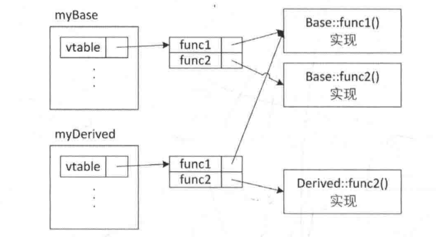

# 面向对象

当声明了一个或多个特殊成员函数(析构函数、拷贝构造函数、移动构造函数、拷贝赋值运算符和移动赋值运算符)时，通常需要声明所有这些函数，这被称为"Rule of Five"。

在现代C++中，要应用"零规则"，即不提供以上五个特殊函数也能确保类的正确使用。这就要求我们避免使用任何旧式的、动态分配的内存，而采用现代结构比如标准库容器。

## 继承

派生类可以访问基类中的`public`、`protected`方法和数据成员，但不能访问基类的`private`成员。

访问说明符的含义一般如下表所示：

| 访问说明符 | 含义 | 使用时机 |
| ----- | ----- | ----- |
| public | 任何代码都可以调用或访问 |暴露给外部的接口 |
| protected | 只有类成员函数可以访问 |子类可以访问 |
| private | 只有类成员函数可以访问 | 数据成员默认为private |

当基类的指针或引用指向派生类对象时，派生类保留其数据成员和重写的方法。但是通过类型转换将派生类对象转换为基类对象时，就会丢失其独有特征。重写方法和派生类数据的丢失称为截断(slicing)。

### final和override

`final`关键字用于指示类或者方法不能被继承。

`override`关键字可以正确指明要重写的基类方法。有的时候，当我们在基类中声明了`virtual`方法，然后在派生类中重写了该方法。如果我们修改了基类的方法，但忘记同步到派生类中，在程序运行时就会调用基类的方法，这与预期不符。使用`override`关键字后，编译器会检查派生类的方法是否正确重写了基类的方法。

```CPP
class Base 
{
    public:
        virtual void someMethod(double d) {}
};


class Derived: public Base 
{
    public:
        virtual void someMethod(int d) override {}
};
```

上述代码在编译时会导致错误，关键字`override`表明将重写基类的`someMethod`方法，但是Base类中只接收双精度数，而不是整数。当要重写某个基类方法时，始终加上`override`关键字。


### 虚函数

C++使用动态绑定来支持虚函数。一旦函数被声明为`virtual`，就会生成一个虚函数表，该表包含指向虚函数的指针。类的每一个对象都包含指向虚函数表的指针，当对象调用某个虚函数时，通过指针找到虚函数表地址，然后根据对象的类型在运行期执行正确的版本。

为了更好地理解虚函数表，我们来看以下这个例子：

```CPP
class Base
{
    public:
        virtual void func1();
        virtual void func2();
};

class Derived: public Base
{
    public:
        void func2() override;
        void noVirtualFunc();
};

Base myBase;
Derived myDerived;
```

下图显示了虚函数表的视图，myBase对象保存了一个虚函数表，myDerived对象保存了另一个虚函数表。虚表中指针指向了不同的实现，由于派生类myDerived没有重写`func1()`，所以它的指针依然指向了Base类中的`func1()`。而重写的`func2()`，则指向了Derived类中的`func2()`。



!!! note

    析构函数必须声明为virtual，以正确调用对应类的析构函数释放资源。

C++中，虚函数表存放于只读数据段(.rodata)，虚函数则存放于代码段(.text)，虚函数表指针存储的位置和所属对象的位置相同，也就是说可以在栈也可以在堆。


## 不同的数据成员类型

### 静态数据成员

有时让类的所有对象都包含某个变量的副本是没有必要的，数据成员只对类有意义，比如我们需要对类的对象进行统计，就可以在类中定义一个`static`数据成员：

```CPP
class MyClass {
    public:
        static int m_count;
};
```

在C++17之前，静态数据成员只能在类外初始化，C++17之后，可以将静态数据成员声明为`inline`直接初始化。

```CPP
class MyClass{
    public:
        static inline int m_count { 0 };
};
```

在类方法内部，可以像使用普通数据成员哪样使用静态数据成员：

```CPP
class MyClass{
    public:
        int getID()const;
    private:
        static inline int m_count { 0 };
        int m_id { 0 };
};

//类的构造函数
MyClass::MyClass(int width, int height):m_id{ ++m_count}, m_width { width }, m_height{ height }
{
    
}
```

如果要在类方法外访问静态数据成员，则只有在public的时候可以通过::作用域解析运算符访问。但一般不推荐这么做，如果要访问，应提供static的get/set方法。

### 引用数据成员

引用数据成员要么在定义时初始化，要么在构造函数初始化器中初始化。它始终指向你要初始化的对象。

### 枚举类型

## 运算符重载

C++20简化了运算符重载的代码编写，只需提供`operator==`和`operator<=>`，就会自动为所有6个比较运算符提供支持。


