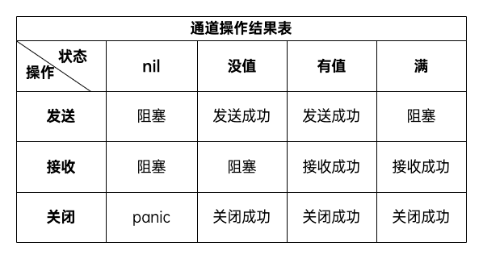

# 并发

Go 语言提供了 Goroutine(协程)和 Channel(管道)来实现并发。

## Goroutine

Goroutine 是 Go 语言提供的轻量级线程，一个 goroutine 会以很小的栈开始其生命周期，由 Go 运行时负责调度。runtime 会智能地将多个 goroutine 合理地分配给 n 个操作系统线程。

在 Go 语言中编写并发程序，只需要将该任务包装成一个函数，然后丢给 goroutine 即可。使用关键字`go`即可创建一个 goroutine。

### main goroutine

在 Go 程序启动时，会自动创建一个 main goroutine。当`main()`函数结束时，整个程序也结束了，所有由 main goroutine 创建的 goroutine 也会一同退出。

### 动态栈

由操作系统创建的线程一般都有固定的栈内存，而 goroutine 属于用户级线程，初始栈空间很小（一般为2KB）。所以在 Go 语言中一次创建数万个 goroutine 也是可能的。并且 goroutine 的栈不是固定的，可以根据需要动态地增大或缩小。go runtime 会自动为 goroutine 分配合适的栈空间。

### goroutine调度

由操作系统控制的线程在进行调度时，需要上下文切换，整个过程比较耗时。而 goroutine 的调度是由 go scheduler 实现的，它在用户态维护了一个类似线程池的概念，会自动地将 goroutine 调度到空闲的线程上运行。

目前 Go 语言采用的是 GPM 调度模型：


- G：即 goroutine， 每执行一个`go func()`语句就会创建一个 goroutine。
- 全局队列：存放等待运行的 G。
- P：表示 goroutine 执行所需要的资源，最多有 GOMAXPROCS(默认值为 CPU 核数) 个。
- P本地队列：同全局队列类似，存放的也是等待运行的G，存的数量有限，不超过256个。新建 G 时，G 优先加入到 P 的本地队列，如果本地队列满了会批量移动部分 G 到全局队列。
- M：线程想运行任务就得获取 P，从 P 的本地队列获取 G，当 P 的本地队列为空时，M 也会尝试从全局队列或其他 P 的本地队列获取 G。M 运行 G，G 执行之后，M 会从 P 获取下一个 G，不断重复下去。
- Goroutine 调度器和操作系统调度器是通过 M 结合起来的，每个 M 都代表了1个内核线程，操作系统调度器负责把内核线程分配到 CPU 的核上执行。


## Channel

Go 语言中的 channel是一种特殊的类型。通道像一个传送带或者队列，总是遵循先入先出的规则，保证收发数据的顺序。每一个 channel 都是一个具体类型的导管，也就是声明 channel 的时候需要为其指定元素类型。

在 channel 变量声明后，需要使用`make()`函数来初始化：

```GO
make(chan type, buffer_size)
```

channel 的操作有发送、接收、关闭三种：

```GO
ch := make(chan int)
ch <- 10 // 发送数据
x := <-ch   // 接收数据
close(ch)   // 关闭通道
```

关闭后的 channel 有以下特点：

- 对一个关闭的 channel 发送数据会导致 panic。
- 对一个关闭的通道进行接收操作会一直获取值直到 channel 为空。
- 关闭一个已经关闭的 channel 会导致 panic。

### 缓冲区

channel 可以设置缓冲区，即指定 channel 的容量。如果缓冲区满了，则发送者会被阻塞，直到缓冲区有空闲位置。

如果没有设置缓冲区，则 channel 必须要指定一个接收方，否则会导致死锁。

### 单向channel

Go 语言提供了单向 channel，即某个 channel 只用来发送或者接收数据：

```GO
<- chan int // 只接收
chan<- int // 只发送
```

箭头的方向决定了当前 channel 允许的操作，这种限制将在编译阶段进行监测。另外，一个只接收的 channel 应该由发送方来关闭。

下面的表格总结了不同状态的 channel 执行的结果：



## select多路复用

Go 内置了`select`关键字来实现多路复用。它可以监听多个 channel 的状态，并根据 channel 的状态来选择执行相应的 case。

```GO
select {
case <-ch1:
    // ch1 有数据
case ch2 <- 10:
    // ch2 已满
default:
    // 其他情况
}
```

`select`语句具有以下特点：

- 可处理一个或多个 channel 的发送/接收操作。
- 如果多个 case 同时满足，则随机选择一个执行。
- 如果没有 case 可执行，则会阻塞。

## 并发锁

### 互斥锁

Go 提供了 sync.Mutex 互斥锁的两个方法：`Lock()`和`Unlock()`。

### 读写互斥锁

sync.RWMutex 提供了以下5个方法：

- `Lock()`：获取写锁
- `Unlock()`：释放写锁
- `RLock()`：获取读锁
- `RUnlock()`：释放读锁
- `RLocker()`：返回一个实现 Locker 接口的读写锁

### 条件变量

sync.Cond 可以提供 goroutine 之间的同步，提供了三个方法：等待通知(wait)、单发通知(signal)、广播通知(broadcast)。条件变量的初始化必须基于锁。

```GO
var mailbox uint8
var lock sync.RWMutex
secondCond := sync.NewCond(&lock)
recvCond := sync.NewCond(lock.RLocker())

func condDemo(lock *sync.RWMutex, cond *sync.Cond) {
    lock.Lock()
    for mailbox == 1 {
        secondCond.Wait()
    }
    mailbox = 1
    lock.Unlock()
    recvCond.Signal()
}
```

请注意，再调用条件变量的`Wait()`方法之前必须先获取锁，调用`Signal()`或`Broadcast()`方法之前必须先释放锁。原因是条件变量的流程先获取锁，然后再解锁：

1. 把调用它的 goroutine 放入当前条件变量的等待队列，并阻塞它。
2. 解锁当前条件变量基于的锁。
3. 当通知到来后，如果要唤醒当前 goroutine，则在唤醒之后会重新锁定条件变量基于的锁，然后再执行剩余代码。

而检查共享资源则总是使用`for`语句。

### WaitGroup

sync.WaitGroup 内部维护一个计数器，默认为0

- `Add()`：增加计数器的值
- `Done()`：减少计数器的值
- `Wait()`：阻塞直到计数器变为0

注意，增加计数器的值和调用`Wait()`方法的代码必须放在同一个 goroutine 中。

### Once

sync.Once 用于保证某个函数只执行一次，这对于那些只需要初始化一次的操作非常有用，比如配置文件的加载。`Do()`方法接收一个函数作为参数，并保证该函数只执行一次。

```GO
var (
    once sync.Once
    config Config
)
func initConfig() {
    config = LoadConfig()
}

func GetConfig() Config {
    once.Do(initConfig)
    return config
}
```

## 原子操作

sync/atomic 包提供了针对整数数据类型（int32、int64、uint32、uint64）的原子操作，方法有：加法(add)、比较并交换(compare and swap)、加载(load)、存储(store)和交换(swap)。

Go 在 1.4 版本添加了 sync/atomic.Value 类型，可以用来原子地存储和加载任意的值，它只有`Store()`和`Load()`两个方法。

## context

context 包提供了一种机制来管理 goroutine 之间的通信、取消操作以及超时控制。它特别适用于需要处理请求的服务器应用程序，其中每个请求可能涉及多个 goroutine。

context.Context 类型提供乐一类代表上下文的值，且可以衍生出任意多个子值，从而构成更复杂的上下文树状结构。树的根节点即为`context.Background()`。context 包提供了四个用于衍生上下文的函数：

- WithCancel:
    - `ctx, cancel := context.WithCancel(parent)`创建一个可取消的 Context。

- WithDeadline:
    - `ctx, cancel := context.WithDeadline(parent, time.Time)`创建一个有截止时间的 Context。

- WithTimeout:
    - `ctx, cancel := context.WithTimeout(parent, time.Duration)`创建一个有超时时间的 Context。

- WithValue:
    - `ctx := context.WithValue(parent, key, value)`创建一个带键值对的 Context。

## 临时对象池

sync.Pool 是一个临时对象池，可以用来缓存临时对象，避免频繁地创建和销毁对象。sync.Pool 只有两个方法：`Get()`和`Put()`——对应获取和存放。注意`Get()`方法会从当前对象池中删除任何一个值，并返回这个值。如果没有任何值，则会调用`New()`创建一个新值再返回。因此我们需要在初始化对象池的时候就指定`New()`。