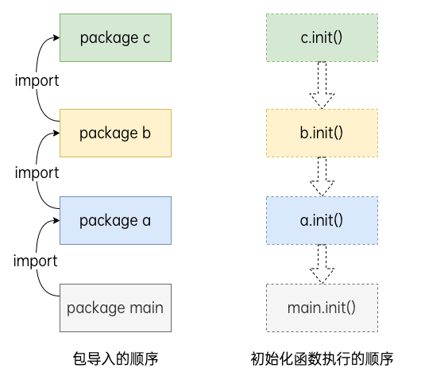

# 包管理

Go 语言中使用包来支持代码模块化和代码复用，一个包是由一个或多个 Go 源码文件组成的。定义包可以用`package package_name`语句，一个包可以简单地理解为一个存放 .go 文件的文件夹，该文件夹下所有的 .go 文件都视为该包的一部分。`main`包提供了应用程序的入口，该包编译后会得到一个可执行文件。

每个程序都是一个包，必须在源文件中非注释的第一行指明这个文件属于哪个包，如：`package main`。`package main` 表示一个可独立执行的程序，每个 Go 应用程序都包含一个名为`main`的包。

一个应用程序可以包含不同的包，而且即使你只使用`main`包也不必把所有的代码都写在一个巨大的文件里：你可以用一些较小的文件，并且在每个文件非注释的第一行都使用`package main`来指明这些文件都属于`main`包。

属于同一个包的源文件必须全部被一起编译，一个包即是编译时的一个单元，因此根据惯例，每个目录都只包含一个包。

如果对一个包进行更改或重新编译，所有引用了这个包的客户端程序都必须全部重新编译。

GO 程序的执行（程序启动）顺序如下：

- 按顺序导入所有被`main`包引用的其它包，然后在每个包中执行如下流程：
- 如果该包又导入了其它的包，则从第一步开始递归执行，但是每个包只会被导入一次。
- 然后以相反的顺序在每个包中初始化常量和变量，如果该包含有`init()`函数的话，则调用该函数。
- 在完成这一切之后，`main`也执行同样的过程，最后调用`main()`函数开始执行程序。



## module

`go module`是 Go 语言的依赖管理工具，要启用它首先要设置环境变量 GO111MODULE：

- GO111MODULE=off：禁用模块支持，编译时会从 GOPATH 和 vendor 目录查找依赖包。
- GO111MODULE=on：启用模块支持，编译时会忽略 GOPATH 和 vendor 目录，只根据 go.mod 文件查找依赖包。
- GO111MODULE=auto：当项目在 GOPATH/src 外切项目根目录有 go.mod 文件时启用模块支持

`go mod`命令用于管理依赖包：

```SHELL
go mod download    下载依赖的module到本地cache（默认为$GOPATH/pkg/mod目录）
go mod edit        编辑go.mod文件
go mod graph       打印模块依赖图
go mod init        初始化当前文件夹, 创建go.mod文件
go mod tidy        增加缺少的module，删除无用的module
go mod vendor      将依赖复制到vendor下
go mod verify      校验依赖
go mod why         解释为什么需要依赖
```

## GOPROXY

GOPROXY 用于设置 Go 模块代理，使得拉取模块时可以通过镜像站点的方式：

```SHELL
go env -w GOPROXY=https://goproxy.cn,direct
```

多个代理地址用逗号隔开，`direct`指示 Go 回到源地址去抓取。

## GOPRIVATE

设置了 GOPROXY 之后，go 命令就会从配置的代理地址拉取和校验依赖包。然而当我们在项目中引入了非公开的包（公司内部 git 仓库或 github 私有仓库等），此时便无法正常从代理拉取到这些非公开的依赖包，这个时候就需要配置 GOPRIVATE 环境变量。GOPRIVATE 用来告诉 go 命令哪些仓库属于私有仓库，不必通过代理服务器拉取和校验。

## 引入外部依赖

使用`go get`命令可以直接从远程仓库下载依赖的包，并在 go.mod 文件中记录依赖信息。

## 引入本地依赖

如果要引入本地依赖，此时分为两种：

- 源码在当前项目路径：`import "主包名/依赖包名"`
- 源码在其他项目路径：在 go.mod 文件中添加`require`语句指定依赖的包，然后在 go.mod 文件中添加`replace`语句，指定依赖包的路径。
