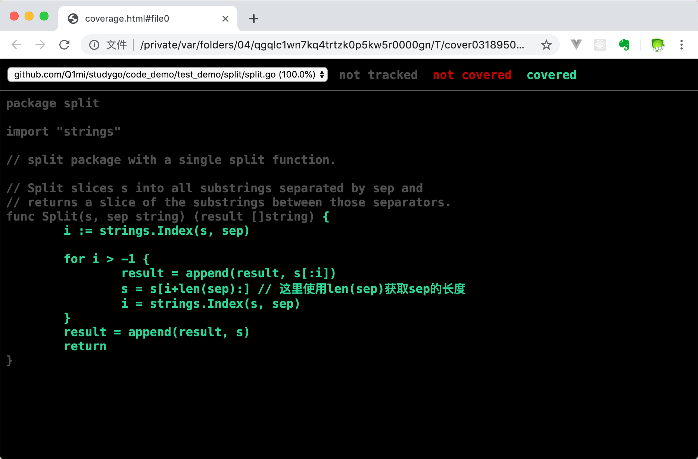

# 单元测试

Go 语言提供了`go test`命令来进行测试，所有以`_test.go`结尾的文件都视为测试文件，不会被编译到最终可执行文件中。

在`_test.go`文件中，有多个测试函数，分别代表不同的用途：

| 类型 | 格式 | 作用 |
| ---- | ---- | ---- |
| 测试函数 | func TestXXX(t *testing.T) | 测试函数的逻辑 |
| 基准函数 | func BenchmarkXXX(b *testing.B) | 测试函数的性能 |
| 示例函数 | func ExampleXXX() | 提供示例代码 |

## 测试函数

测试函数必须以 Test 开头，后缀名必须以大写字母开头，比如：

```GO
func TestAdd(t *testing.T){...}
func TestSub(t *testing.T){...}
```

参数 t 用于报告测试失败的附加的日志信息：

```GO
func (c *T) Error(args ...interface{})
func (c *T) Errorf(format string, args ...interface{})
func (c *T) Fail()
func (c *T) FailNow()
func (c *T) Failed() bool
func (c *T) Fatal(args ...interface{})
func (c *T) Fatalf(format string, args ...interface{})
func (c *T) Log(args ...interface{})
func (c *T) Logf(format string, args ...interface{})
func (c *T) Name() string
func (t *T) Parallel()
func (t *T) Run(name string, f func(t *T)) bool
func (c *T) Skip(args ...interface{})
func (c *T) SkipNow()
func (c *T) Skipf(format string, args ...interface{})
func (c *T) Skipped() bool
```

### 子测试

当测试用例比较多的时候，可以使用子测试。

### 测试覆盖率

测试覆盖率指的是语句覆盖率，即编写的代码中有多少语句被测试用例覆盖了。可以使用`go test -cover`命令来查看测试覆盖率。`-coverprofile`参数可以生成测试覆盖率报告。



## 基准测试

基准测试是指在一定的工作负载之下，检验程序的性能，基本格式如下：

```GO
func BenchmarkName(b *testing.B){
    // ...
}
```

`testing.B`拥有的方法如下：

```GO
func (c *B) Error(args ...interface{})
func (c *B) Errorf(format string, args ...interface{})
func (c *B) Fail()
func (c *B) FailNow()
func (c *B) Failed() bool
func (c *B) Fatal(args ...interface{})
func (c *B) Fatalf(format string, args ...interface{})
func (c *B) Log(args ...interface{})
func (c *B) Logf(format string, args ...interface{})
func (c *B) Name() string
func (b *B) ReportAllocs()
func (b *B) ResetTimer()
func (b *B) Run(name string, f func(b *B)) bool
func (b *B) RunParallel(body func(*PB))
func (b *B) SetBytes(n int64)
func (b *B) SetParallelism(p int)
func (c *B) Skip(args ...interface{})
func (c *B) SkipNow()
func (c *B) Skipf(format string, args ...interface{})
func (c *B) Skipped() bool
func (b *B) StartTimer()
func (b *B) StopTimer()
```


### 性能比较函数

如果我们想要知道某一函数对于不同输入的性能，就可以使用性能比较函数，比如

```GO
func Benchmark(b *testing.B, size int){}
func Benchmark10(b *testing.B){ Benchmark(b, 10) }
func Benchmark100(b *testing.B){ Benchmark(b, 100) }
func Benchmark1000(b *testing.B){ Benchmark(b, 1000) }
```

### 重置时间

`b.ResetTimer()`用于重置计时器，在该函数调用之前的处理不会计入到最终的执行时间里去，比如：

```GO
func Benchmark(b *testing.B){
    time.Sleep(10 * time.Second)
    b.ResetTimer()
    //...
}
```

### 并行测试

`b.RunParallel(body func(*PB))`用于并行测试，它将创建多个 goroutine 并将测试函数的执行分发到这些 goroutine 上，其中 goroutine 的数量默认为 GOMAXPROCS。

## 示例函数