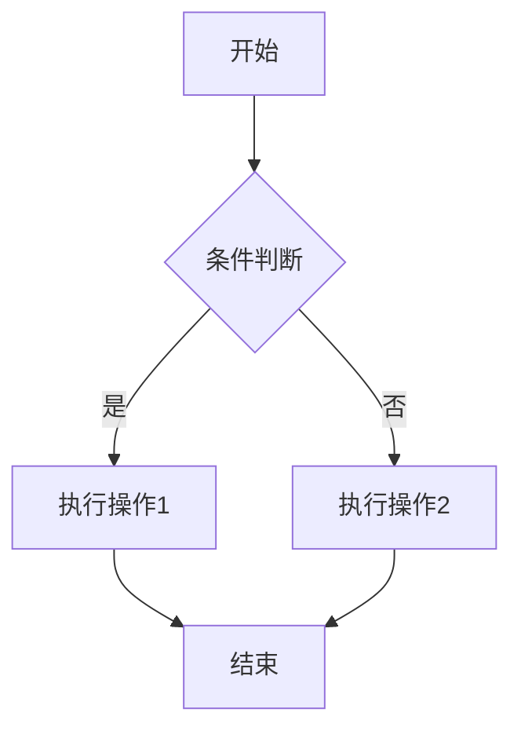

# Python

## 虚拟环境

Python 可以创建虚拟环境以隔离不同项目的依赖关系，具体步骤如下：

1. 创建虚拟环境目录：`python -m venv myenv`
2. 激活虚拟环境：`source myenv/bin/activate`
3. 停用虚拟环境：`deactivate`

如果需要将虚拟环境中的包导出，可以在激活虚拟环境后使用`pip freeze > requirements.txt`导出依赖关系。

