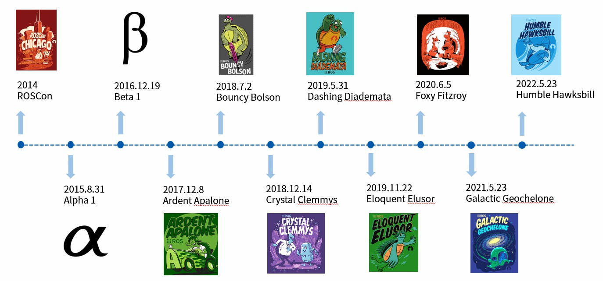
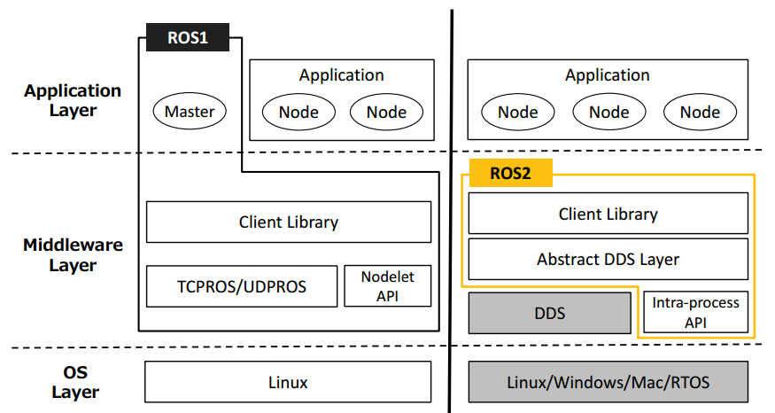
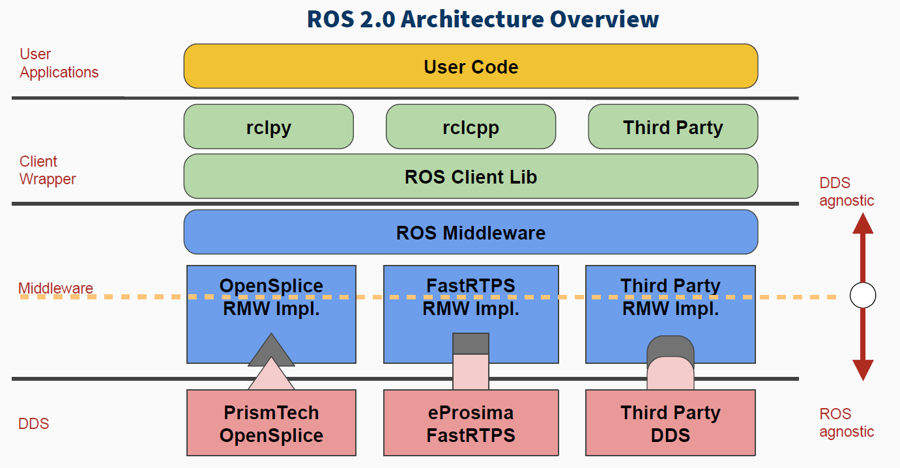
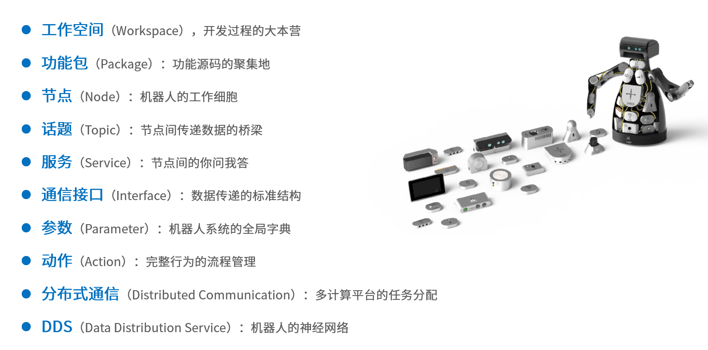
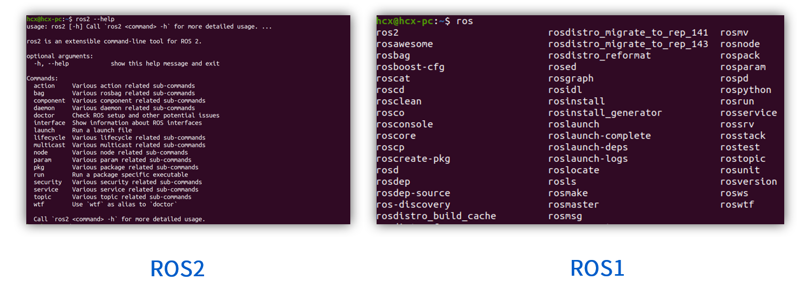

# 入门介绍

2022年5月底，ROS2 Humble发布，这是ROS2的第一个长期支持版本，标志着ROS进入了全新的发展阶段。

一个新版本的发布必然是因为旧版本有一些问题。ROS2没有修修补补，而是直接推倒重来，对系统架构和软件代码全部重新设计。与ROS1相比，主要体现在以下三点：

- 架构重做：ROS1中所有节点都要在Master节点下管理，一旦Master出现问题，系统就会死机。ROS2使用基于DDS的Discovery机制，实现了真正的分布式通信。
- API重构：ROS2结合C++最新标准和Python3语言特性，设计了更具通用型的API。
- 编译系统升级：ROS1的rosbuild和catkin问题诸多，尤其是对于代码较多的大型项目而言。ROS2对这些问题进行了优化，新的编译系统命名为ament和colcon。

## 系统架构

- ROS2去掉了Master节点，取而代之的是基于DDS的Discovery机制。
- Middleware是ROS封装好的标准通信接口，编写代码时，用户只需要关注业务逻辑，由中间层去调用底层复杂的驱动和通信接口。

## DDS通信

ROS1中基于TCP/UDP的通信系统，长期诟病于延迟高、丢数据、无法加密等问题，ROS2使用DDS作为通信协议，并设计了中间件，由厂家自己去适配DDS协议，用户无需关心细节。

## 核心概念

## 命令行

ROS1中的命令行非常分散，每一个功能都是一个独立的命令，比如`rosrun`启动一个节点。
ROS2对命令行做了集成，所有的命令都集成在一个ros2主命令中。

