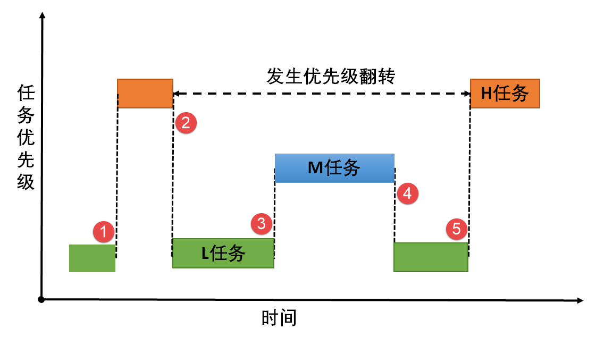

# 简明入门
大多数的操作系统都能同时执行多个程序，这被称为多任务处理。实际上，每个处理器核心在给定时间片内只能运行单个任务。CPU通过快速切换时间片造成多个任务同时执行的假象。
实时操作系统(RTOS)中的任务调度器旨在提供可预测的执行模式。这种方式对嵌入式系统意义重大，因为嵌入式系统往往有实时性的要求，比如我要求在3秒内发出警报声。

使用STM32CubeMX创建的FreeRTOS工程中，源码主要涉及两个目录：

- Core
    - Inc目录下的FreeRTOSConfig.h是配置文件
    - Src目录下的freertos.c是STM32CubeMX创建的默认任务
- Middlewares/Thirt_Party/FreeRTOS/Source
    - 根目录下是核心文件，这些文件是通用的
    - portable目录下是移植时需要的文件：port.c和portmacro.h
        - 目录名为：[compiler]/[architecture]
        - 比如：RVDS/ARM-CM3，这表示cortexM3架构在RVDS工具上的移植文件

| FreeRTOS/Srouce/ | 作用 |
| ---- | ---- |
| tasks.c | 必须，任务操作 |
| list.c | 必须， 列表 |
| queue.c | 基本必须，提供队列操作、信号量 |
| timer.c | 可选，提供定时器 |
| event_groups.c | 可选，提供event group功能 |
| croutine.c | 可选，已过时 |


头文件目录需要包含：

- FreeRTOS自身头文件：Middlewares/Third_Party/FreeRTOS/Source/include

- 配置文件：Core/Inc/FreeRTOSConfig.h

数据类型：

在portmacro.h头文件里，定义了两个数据类型：

- TickType_t：
    - FreeRTOS配置了一个周期性的时钟中断：Tick Interrupt
    - 每发生一次中断，中断次数累加，这被称为tick count
    - tick count这个变量的类型就是TickType_t
    - TickType_t可以是16位的，也可以是32位的
    - FreeRTOSConfig.h中定义configUSE_16_BIT_TICKS时，TickType_t就是uint16_t
    - 否则TickType_t就是uint32_t
    - 对于32位架构，建议把TickType_t配置为uint32_t
- BaseType_t：
    - 这是该架构最高效的数据类型
    - 32位架构中，它就是uint32_t
    - 16位架构中，它就是uint16_t
    - 8位架构中，它就是uint8_t
    - BaseType_t通常用作简单的返回值的类型，还有逻辑值，比如pdTRUE/pdFALSE

命名规范：

| 变量名前缀 | 含义 |
| --- | --- |
| ul | uint32_t |
| us | uint16_t |
| uc | uint8_t |
| x | 非stdint类型，比如BaseType_t和TickType_t，或者size_t |
| ux | UBaseType_t |
| e | enum |
| p | 指针 |
| c | char |

| 函数名前缀 | 含义 |
| --- | --- |
| prv | 私有函数(file scope) |
| v | 返回值void |
| task | 定义在task.c |

| 宏前缀 | 含义 |
| --- | --- |
| config | 定义在FreeRTOSConfig.h |

## 内存管理

每次创建任务、队列、互斥锁、软件定时器、信号量或事件组时，内核都需要RAM，RAM可以由RTOS堆动态分配，也可以由编写者手动提供。

尽管C库提供了*malloc()*和*free()*函数，但是：
1. 它们并不总是适用于嵌入式系统
2. 它们耗费时间比较长
3. 它们不是线程安全的
4. 运行结果不确定

因此freertos实现了自己的内存分配接口函数。

freertos中有五种堆内存，文件定义在Middlewares/Third_Party/FreeRTOS/Source/portable/MemMang下。其中最常用的是heap_4.c，它可以将相邻的空间内存块合并，解决了内存碎片问题。而heap_5.c允许多个不连续的内存区域。需要用到以下结构体进行不同内存块的初始化：

```C
typedef struct HeapRegion
{
    uint8_t *pucStartAddress;   //起始地址
    size_t xSizeInBytes;       //大小
}HeapRegion_t;
```

当指定多块内存时，需要用到HeapRegion_t类型的数据，每个数组元素都是一个HeapRegion_t元素。这个数组中，低地址在前，高地址在后。

```C
HeapRegion_t xHeapRegions[] = 
{
    {(uint8_t *)0x80000000UL, 0x10000}, //起始地址和大小
    {(uint8_t *)0x90000000UL, 0x10000}, 
    {NULL, 0}  //表示数组结束
};
```

定义了内存块数组还需要对其进行初始化：

```C
void vPortDefineHeapRegions(const HeapRegion_t *const pxHeapRegions);
```

Heap的分配和释放：

```C
void *pvPortMalloc(size_t xWantedSize);
void vPortFree(void *pv);
```

获取当前空闲内存空间：

```C
size_t xPortGetFreeHeapSize(void);
```

获取程序运行时空闲内存的最小值：

```C
size_t xPortGetMinimumEverFreeHeapSize(void);
```

## 任务管理

一个任务最基本的元素有：

- 任务状态：比如阻塞，就绪，挂起等
- 优先级：每个任务都分配了从0到configMAX_PRIORITIES-1的优先级
- 栈：用来保存任务的局部数据
- 事件：表示任务做了什么事情

对于单核处理器来说，任何时刻只能有一个任务得到运行，当调度器决定切换任务时，需要将上一个任务的上下文（寄存器，栈）保存。需要注意的是，如果一个任务出现了死循环操作，那么比这个任务优先级低的任务都将无法执行。所以在设计的时候，应该保证任务在不活跃状态时进入阻塞状态以让出CPU使用权，保证其他低优先级的任务可以执行。

### 创建任务

在FreeRTOS中，任务函数的定义如下：

```C
void vATaskFunction(void *pvParameters)
{
    for(;;)
    {
        //RTOS推荐采用事件驱动型任务
        if(WaitForEvent(EventObject, Timeout) == pdPASS)
        {
            //处理事件
        }
        else
        {
            
        }
    }

    vTaskDelete(NULL);  //执行完毕删除自己
}

```
动态创建任务使用的函数如下：

```C
BaseType_t xTaskCreate(TaskFunction_t pxTaskCode,
                        const char *const pcName, 
                        const configSTACK_DEPTH_TYPE usStackDepth,
                        void *const pvParameters,
                        UBaseType_t uxPriority,
                        TaskHandle_t *const pxCreatedTask);
```

参数说明：

| 参数 | 描述 |
| --- | --- |
| pvTaskCode | 任务函数 |
| pcName | 任务名称 |
| usStackDepth | 任务栈大小，单位word |
| pvParameters | 传递给任务函数的参数 |
| uxPriority | 任务优先级 |
| pxCreatedTask | 任务句柄，用来操作任务函数 |
| 返回值 | 成功返回pdPass，失败通常是因为内存不足 |

静态创建任务使用的函数如下：

```C
TaskHandle_t xTaskCreateStatic(TaskFunction_t pxTaskCode,
                                const char *const pcName,
                                const uint32_t ulStackDepth,
                                void *const pvParameters,
                                UBaseType_t uxPriority,
                                StackType_t *const puxStackBuffer,
                                StaticTask_t *const pxTaskBuffer);
```

相对于动态分配，有两个参数不同：

| 参数 | 描述 |
| --- | --- |
| puxStackBuffer | 栈数组，索引必须不小于ulStackDepth |
| pxTaskBuffer | 指向StaticTask_t的指针，用来保存任务结构体 |

每个任务都需要RAM来保存任务状态，并由任务用作其堆栈。如果使用动态创建，则会在程序运行时从FreeRTOS堆中自动分配RAM。如果是静态创建，RAM由编写者手动提供，但在编译时就已确定。

### Tick

任务进入睡眠后需要指定唤醒的时间，FreeRTOS通过Tick变量测量时间。定时器中断以严格的时间精度增加Tick count。每次Tick增加时，内核必须检查现在是否需要解除阻塞或者唤醒任务，高优先级的任务先被唤醒。任务通过调用*vTaskDelay()*函数来主动等待一定的时间。宏*pdMS_TO_TICKS()*将毫秒转换为Tick count。

需要注意的是，由于内核本身的任务切换需要时间，当指定N个Tick的延迟后，实际延迟时间将在(N-1)~(N)个Tick之间。

### 任务状态

任务可以有以下状态：

- 运行：最高优先级的任务被执行

- 就绪：能够执行，等待调度器调度

- 阻塞：正在等待时间或者外部事件

- 挂起：放弃CPU使用权，不参与调度。


### 调度算法

两个核心概念：**抢占**和**轮转**。通过配置configUSE_PREEMPTION使能抢占，即高优先级的任务可以抢占低优先级的任务。通过配置configUSE_TIME_SLICING使能轮转，即相同优先级的任务轮流执行。

### 空闲任务和钩子函数

在没有其他任务运行的时候，执行空闲任务。*vTaskStartScheduler()*函数内部会创建空闲任务，它的优先级为0，永远低于用户任务，且要么处于就绪态，要么处于运行态。

我们可以在空闲任务内添加一个钩子函数，这样空闲任务每执行一次，都会调用一次钩子函数。钩子函数的作用是：

- 执行一些后台任务
- 测量系统空闲时间
- 使系统进入省电模式

要注意的是，钩子函数不能调用任何使其导致阻塞的函数。空闲钩子函数的定义如下：

```C
void vApplicationIdleHook(void);
```

## 任务同步与通信

这里面的内容以理解原理为主，没有必要去记函数接口，用到什么就查什么。

### 消息队列

消息队列简称为队列，是一种先进先出的数据结构，支持任务或者中断的读写。当队列中的消息为空时，读取消息的任务将被阻塞；当队列已满，发送消息的任务将被阻塞。可以将一条或者多条消息放入队列中，多个任务也可以从同一个消息队列读写消息。如果是紧急消息，可以发送至队列头从而提前被接收。

为了实现先进先出的机制，队列使用了阻塞的机制。当任务A对某个队列进行读操作时，如果队列此时为空，那么它可以选择：

1. 直接放弃读操作，去干别的事情。
2. 进入阻塞状态，等待一段时间。如果在等待期间消息来了，就变为就绪状态；如果等待时间过了消息都没来，那么就返回一个未收到消息的错误码，然后执行其他程序。
3. 死等直到消息到来为止。

写操作的阻塞机制类似。

注意：由于中断函数也可以对队列进行读写操作，但是中断函数不允许阻塞，因此在中断处理流程中必须使用特殊的读写函数接口。

### 信号量

信号量分为二值信号量和计数信号量，其原理和Linux内核相似，这里不再赘述。

### 互斥量

互斥量是特殊的二值信号量，有着递归访问和防止优先级反转的特性，主要用于临界资源的保护。互斥量具有特殊的优先级继承的机制，要理解这个机制，我们首先要解释下什么是优先级反转。

在一个简化过的场景中，有三个任务H、M、L，它们的优先级依次为H>M>L。H与L共享某个资源，M不共享。在正常情况下，最高优先级的H应该能够优先执行，并且有权限打断M或者L的执行状态从而抢占CPU的控制权。然而存在一种情况,会导致H一直被阻塞，等待M和L的完成运行：

在某一时刻，L已经获取了共享资源的使用权，正在执行自己的任务。如果此时H被唤醒，由于H的优先级大于L，它尝试获取CPU的控制权。但是由于共享资源被L占用，H不得不等待L释放资源而进入阻塞状态。有趣的是，如果M被唤醒，由于M与L并不共享资源且优先级大于L，它将立刻中断L的执行，获取CPU的控制权。只有当M执行完毕时，才会将CPU控制权归还给L，使其可以继续执行剩余的代码。一旦L执行完毕后释放了共享资源，H任务才能从阻塞状态中被唤醒。我们发现，最高优先级的任务H反而需要等待两个低优先级的任务先执行完毕，其阻塞时间等于M和L的执行时间之和。这种现象被称为“优先级反转”，在系统中可能导致严重后果，甚至崩溃。例如，如果一辆汽车的刹车系统是最高优先级的任务，但需要等待其他任务执行完毕，这将导致灾难性的后果。因此为了确保系统的稳定运行，必须解决优先级反转问题。



但是假如我们引进了优先级继承机制。同样是L获取共享资源，H进入阻塞状态。系统临时将L的优先级提升到H，那么M就无法打断L的执行。所以L执行完它的任务就会立刻释放资源，然后由H来抢占CPU的使用权。其阻塞时间仅仅是L的执行时间，这将大大降低优先级反转的危害。

### 事件组

事件组主要用来实现多任务间的同步，只能用来事件的通信，不能用来发送数据。可以是一对多，也可以是多对一。

事件组用一个EventBits_t类型的变量来表示，其中高8位留给内核，用其他的位来表示事件。每一位都代表一个事件，含义由编写者决定，比如用bit0表示灯泡亮灭，bit1表示按键是否按下。这些位，值为1表示事件发生，值为0表示事件未发生。任务通过“逻辑与”、“逻辑或”与一个或者多个事件建立关联。逻辑与表示任务感兴趣的多个事件同时发生才被唤醒，逻辑或表示任一事件发生即可被唤醒。

事件组的操作流程如下：

- 创建一个事件组
- 任务A、B控制事件中的某些位
- 任务C、D等待事件中的位，并且决定发生事件后的操作

这里对两个比较重要的函数说明一下：

等待事件函数：

```C
EventBits_t xEventGroupWaitBits(EventGroupsHandle_t xEventGroup,
                                const EvetnBits_t uxBitsToWaitFor,
                                const BaseType_t xClearOnExit,
                                const BaseType_t xWaitForAllBits,
                                TickType_t xTickToWait);
```

| 参数 | 说明 |
| --- | --- |
| xEventGroup | 等待的事件组 |
| uxBitsToWaitFor | 等待的位 |
| xClearOnExit | pdTRUE:清除位 |
| xWaitForAllBits | pdTRUE：等待的位全部为1；pdFALSE：某一位为1 |
| xTicksToWait | 阻塞时间 |

举例说明：

| 事件组的值 | uxBitsToWaitFor | xWaitForAllBits | 说明 |
| --- | --- | --- | --- |
| 0100 | 0101 | pdTrue | 期望bit0,bit2都为1，不满足进入阻塞 |
| 0100 | 0110| pdFALSE | 期望bit0, bit2某位为1，满足退出 |

同步事件函数：

```C
EventBits_t xEventGroupSync(EventGroupHandle_t xEventGroup,
                            const EventBits_t uxBitsToSet,
                            const EventBits_t uxBitsToWaitFor,
                            TickType_t xTicksToWait);
```

该函数用来协同多个任务，当期望的事件一起发生后，才会成功返回。

### 任务通知

FreeRTOS从V8.2.0版本开始提供任务通知这个功能。在大多数情况下，任务通知可以替代信号量、事件组，也可以替代长度为1的队列。任务通知更加灵活，执行速度更快，并且更加节省RAM空间，缺点是任务通知只能由一个任务来接收通知消息。

FreeRTOS提供以下几种方式发送通知给任务：

- 如果有通知未读，不覆盖通知值
- 直接覆盖通知值
- 设置通知值的一个或者多个位，类似事件组
- 递增通知值，类似计数信号量

任务通知是任务控制块中定义的一个成员变量，因此任务在被创建的时候，任务通知就已经被初始化了。任务通知可以由任务发送，也可以由中断发送。只有在任务中才可以等待通知，而不允许在中断中等待通知。如果任务在等待通知的时候暂时无效，则任务会根据用户指定的阻塞时间内进入阻塞状态。只要有任务或者中断发送任务通知，任务就会从阻塞状态解除。

每个任务都有一个结构体:TCB（Task Control Block），里面有两个成员，一个用来表示通知状态，一个用来表示通知值。

```C
typedef struct tskTaskControlBlock
{
    ......
    /* configTASK_NOTIFICATION_ARRAY_ENTRIES = 1 */
    volatile uint32_t ulNotifiedValue[ configTASK_NOTIFICATION_ARRAY_ENTRIES ];
    volatile uint8_t ucNotifyState[ configTASK_NOTIFICATION_ARRAY_ENTRIES ];
    ......
} tskTCB;
```

通知状态有3种取值：

- taskNOT_WAITING_NOTIFICATION：任务没有在等待通知
- taskWAITING_NOTIFICATION：任务在等待通知
- taskNOTIFICATION_RECEIVED：任务接收到了通知


## 软件定时器

软件定时器就是“闹钟”，你可以设置闹钟：早上7点叫醒你；或者，每工作一小时就休息一会。软件定时器的功能类似，可以是在未来某个时间点触发某个函数，也可以是周期性地运行函数。

软件定时器是由操作系统提供的一类接口，它构建在硬件定时器基础之上，以系统节拍周期为单位。系统节拍就是系统时钟的频率，配置为configTICK_RATE_HZ，默认为1000。也就是说1s跳动1000次，那么系统街拍周期就是1ms。软件定时器的定时数值必须是这个节拍周期的整数倍。当然，系统节拍精度越高，软件定时器所能设定的时间间隔就越小，但是系统的开销也会变大。

FreeRTOS通过一个prvTimerTask的守护任务来管理软件定时器，它是在启动调度器时自动创建的。守护任务会定期检查用户编写的定时器，并调用其回调函数。用户自己编写的任务函数要调用定时器函数时，是通过“定时器命令队列”和守护任务交互的。守护任务的主要工作就是从命令队列中取出命令、处理，执行定时器的回调函数。能否及时处理定时器命令，取决于守护任务的优先级。其优先级默认为confiTIMER_TASK_PRIORITY，为了更好地响应，该优先级应设置为所有任务中最高的优先级。

定时器回调函数的原型如下：

```C
void ATimerCallback(TimerHandler_t xTimer);
```

定时器的回调函数是在守护任务中被调用的，因此该函数不能进入阻塞状态，也不能调用任何会引起阻塞的函数。

定时器的复位：

```C
BaseType_t xTimerReset(TimerHandle_t xTimer, TickType_t xTicksToWait);
```

使用该函数可以让定时器的状态从冬眠态变为运行态，如果定时器已经运行，则相当于重新确定超时时间。

修改周期：

```C
BaseType_t xTimerChangePeriod(TimerHandle_t xTimer, TickType_t xNewPeriod, TickType_t xTicksToWait);
```

## 中断管理

中断属于异步异常，来源于外部硬件。当没有中断发生时，CPU执行自己的任务。当中断产生时，CPU当前任务被打断，转而去执行中断处理程序。外部设备产生一个中断信号并发送至中断控制器，由中断控制器将信号再转发给CPU，CPU响应中断源的请求。当中断产生时，系统需要保存上下文状态。

中断的环境有两种：

- 任务上下文：无论中断的优先级是多大，都会打断当前任务的执行。
- 中断上下文：仅更高优先级的中断可以打断当前中断的执行，这必须要系统支持中断嵌套。

