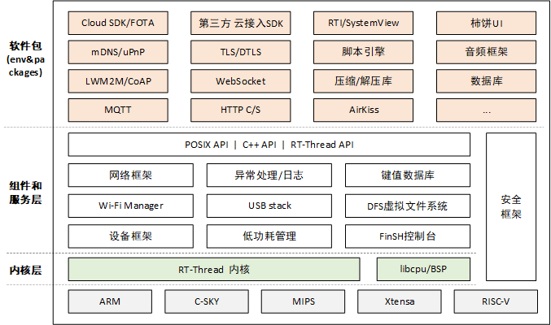
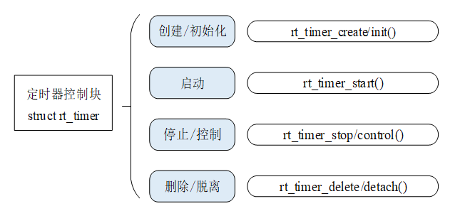
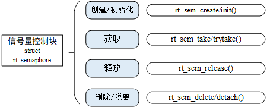
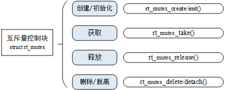
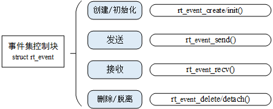
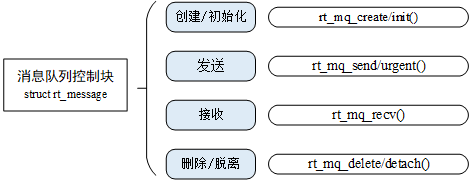
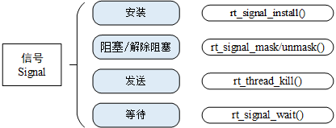

# rtt内核简介

> 由于不同RTOS的内核大差不差，这里只记录下rtt内核比较特殊的地方。

rtt内核架构如下图所示：



rtt内核模块主要分为：

1. 线程调度
2. 时钟管理
3. 线程间同步与通信
4. 内存管理
5. 中断管理
6. I/O设备管理
7. 外设接口

下图显示了rtt中各类内核对象的派生和继承关系。


内核对象控制块的数据结构如下：

```C
struct rt_object {
    char name[RT_NAME_MAX];    //内核对象名称
    rt_uint8_t type;           //内核对象类型
    rt_uint8_t flag;           //内核对象参数
    rt_list_t list;            //内核对象管理链表
};
```

内核对象容器的数据结构如下：

```C
struct rt_object_information {
    enum rt_object_class_type type;    //对象类型
    rt_list_t object_list;             //对象链表
    rt_size_t object_size;             //对象大小
};
```

同一类对象由一个rt_object_information结构体来管理，这类对象的每个实例以链表的形式挂在object_list链表上。当某个内核对象被初始化后，该对象就被添加到对应容器中管理。

## 线程管理

rtt中线程状态多了一个初始状态，当线程创建完毕还没开始运行时就处于初始状态，该状态下线程不参与调度，宏定义为RT_THREAD_INIT。初始状态的线程需要调用*rt_thread_startup()*进入就绪状态。

rtt最大支持256个优先级，对于ARM Cortex-M系列一般采用32个优先级。

每个线程都有时间片参数，时间片仅对优先级相同的就绪状态线程有效（即同优先级参与调度）。时间片的单位是一个系统节拍，其意义是线程单次运行的时长。

使用*rt_thread_create()*函数创建一个动态线程，使用*rt_thread_delete()*函数删除一个动态线程。静态线程的API分别是*rt_thread_init()*函数和*rt_thread_detach()*函数。使用*rt_thread_startup()*函数启动线程，*rt_thread_yield()*函数让出线程资源，*rt_thread_delay()*函数使线程睡眠，*rt_thread_resume()*函数恢复线程。

## 时钟管理

全局变量rt_tick每次经过一个时钟节拍，值就会加1，它表示系统从启动开始总共经过的始终节拍数。此外，rt_tick每次加1都会检查当前线程的时间片是否使用完，以及是否有定时器超时。

rtt的定时器可以分为HARD_TIMER模式——在中断环境中执行，和SOFT_TIMER模式——在线程环境中执行。

新创建并激活的定时器都会以超时时间排序的方式插入到rt_timer_list链表中。所有定时器在定时超时后都会从定时器链表中被移除，而周期性定时器会在它再次启动时被加入定时器链表。与定时器有关的操作如下图所示：



## 线程间同步

### 信号量

信号量相关接口函数如下：



rtt内核在创建信号量的时候，可以通过flag参数指定信号量不可用时多个线程等待的排队方式。比如RT_IPC_FLAG_FIFO表示按照先进先出的方式排队，RT_IPC_FLAG_PRIO表示按照优先级的方式进行排队。一般采用优先级方式，除非应用程序非常在意先来后到。

### 互斥量

互斥量相关接口函数如下：



互斥量主要适用于以下情况：

1. 线程多次持有互斥量，互斥量可以递归持有而信号量会导致死锁。
2. 由于多线程同步而造成优先级反转问题。

### 事件组

rtt定义的事件集有以下特点：

1. 事件只与线程相关，事件间相互独立：每个线程可拥有 32 个事件标志，采用一个 32 bit 无符号整型数进行记录，每一个 bit 代表一个事件；

2. 事件仅用于同步，不提供数据传输功能；

3. 事件无排队性，即多次向线程发送同一事件 (如果线程还未来得及读走)，其效果等同于只发送一次。

每个线程都拥有一个事件信息标记，它有三个属性，分别是RT_EVENT_FLAG_AND(逻辑与)，RT_EVENT_FLAG_OR(逻辑或）以及RT_EVENT_FLAG_CLEAR(清除标记）。当线程等待事件同步时，可以通过32个事件标志和这个事件信息标记来判断当前接收的事件是否满足同步条件。

事件组相关接口函数如下：



## 线程间通信

### 邮箱

邮箱的特点是开销比较低，效率较高。邮箱中的每一封邮件只能容纳固定的4字节内容，也就是说邮箱只能用来传输固定大小的内容。邮箱使用一个固定缓冲区大小来存储邮件，其大小在创建时被定义。

非阻塞方式的邮件发送过程能够安全的应用于中断服务中，是线程、中断服务、定时器向线程发送消息的有效手段。根据对应的情况，邮箱的收取或者发送都可以设置为超时阻塞，进入阻塞状态的线程将睡眠，等待对应条件满足后唤醒。

邮箱相关接口函数如下：


### 消息队列

消息队列是邮箱的扩展，可以用来传输不固定长度的内容。

消息队列需要将消息缓存在自己的内存空间中，因此内存占用比邮箱要大。多个线程能够读取同一个消息队列。而当消息队列是空的时候，可以挂起读取线程。当有新的消息到达时，挂起的线程将被唤醒以接收并处理消息。消息队列是一种异步的通信方式。

消息队列相关接口函数如下：



### 信号

信号其实是用户层面对硬件中断的一种模拟，一个线程收到信号之后会转去对应的信号处理函数。rtt中使用rt_sigset_t类型来定义信号集。

当一个线程收到信号时，如果它处于挂起状态，那么它会改为就绪状态去处理对应的信号。

信号相关接口函数如下：



在信号的使用过程中，先定义线程需要的信号处理函数，然后使用*rt_signal_install()*函数将signo与对应的信号处理函数相关联。

## 内存管理


