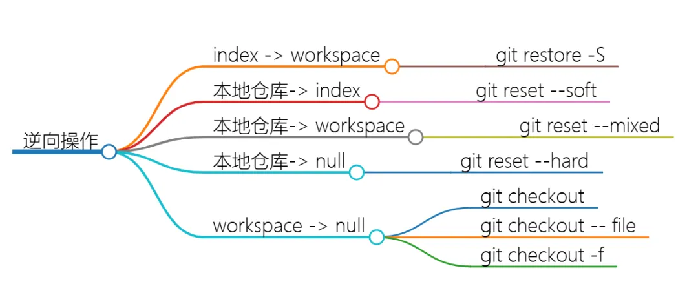

# github

github 是目前最流行的开源代码托管平台之一，本文将介绍如何使用github。

## 添加SSH密钥

将你电脑的 SSH 密钥添加至 github，你就可以使用 SSH 连接以替代传统的 HTTPS 连接。

1. 首先输入以下命令，将邮件地址改为你注册 github 的邮箱：

    ```SHELL
    ssh-keygen -t ed25519 -C "your_email@example.com"
    ```

    系统会要求你输入一些信息，连续按回车跳过即可。

2. 将 SSH 密钥添加到 ssh-agent：

    启动 ssh 代理：

    ```SHELL
    eval "$(ssh-agent -s)"
    ```

    然后添加私钥：

    ```SHELL
    ssh-add ~/.ssh/id_ed25519
    ```

3. 向你的账户添加新的 SSH 密钥

    现在，.ssh/ 目录下有两个文件，以 pub 结尾的就是公钥，公钥是开放的，可以共享给别人，私钥则必须由自己保存。

    ```SHELL
    cat ~/.ssh/id_ed25519.pub
    ```

    复制打印的内容，然后在 github 个人资料页面找到 Settings → SSH and GPG keys → New SSH key，添加即可。

## HTTPS连接

过去，HTTPS 连接要求你输入用户名和密码，但是这种方式由于不安全已经被 github 废弃。现在，要想通过 HTTPS 连接，你必须使用另外一种叫[Git Credential Manager](https://github.com/git-ecosystem/git-credential-manager/blob/main/README.md)的方式。具体操作请查看官网文档。

## SSH连接

SSH 连接默认采用 22 端口，但是有时候防火墙会阻止这种行为。如果遇到这种情况，你可以采用上面的 HTTPS 连接。如果 HTTPS 连接也不行，你可以尝试采用 HTTPS 端口的 SSH 连接。

要测试通过 HTTPS 端口的 SSH 连接是否可行，输入以下命令：

```SHELL
ssh -T -p 443 git@ssh.github.com

> Hi USERNAME! You've successfully authenticated, but GitHub does not provide shell access.
```
如果输出以上内容，则说明连接可行。你可以更改 ~/.ssh/config 文件，强制与 github 的连接都通过 SSH 的 443 端口。

```SHELL
Host github.com
Hostname ssh.github.com
Port 443
User git
```

更改配置后，再次测试 SSH 连接是否可行：

```SHELL
ssh -T git@github.com

> Hi USERNAME! You've successfully authenticated, but GitHub does not provide shell access.
```

!!! note ""

    注意：SSH 通过公钥和私钥配对的方式来验证连接是否安全，当你第一次通过 SSH 连接时，会询问你是否信任该服务器，输入yes即可。github 的 SSH 公钥存放在[Github's SSH key fingerprints](https://docs.github.com/en/authentication/keeping-your-account-and-data-secure/githubs-ssh-key-fingerprints)。你可以添加到~/.ssh/known_hosts来避免验证。


## 网络配置

github 支持流量代理：

```SHELL
git config --global http.proxy http://127.0.0.1:[端口号]
 
git config --global https.proxy http://127.0.0.1:[端口号]
```

这两行命令的意思是让 http 和 https 协议的流量全部走你梯子的代理，端口号根据梯子的配置自行输入。配置完以后`git clone`应该不会卡了。如果你要取消全局代理，输入以下命令：

```SHELL
git config --global --unset http.proxy
 
git config --global --unset https.proxy
```

## 管理远程仓库

要添加一个远程仓库链接，使用`git remote add` 命令，该命令需要两个参数：

- 远程仓库名，比如`origin`
- 远程仓库地址，比如`https://github.com/OWNER/REPOSITORY.git`

```SHELL
git remote add origin https://github.com/OWNER/REPOSITORY.git
```

在添加完远程仓库后，可以使用`git remote -v`命令可以查看你当前添加的远程仓库：

```SHELL
git remote -v
# Verify new remote
> origin  https://github.com/OWNER/REPOSITORY.git (fetch)
> origin  https://github.com/OWNER/REPOSITORY.git (push)
```

如果要更改连接远程仓库的方式，比如从 HTTPS 改为 SSH，则可以使用`git remote set-url`命令：

```SHELL
git remote set-url origin git@github.com:OWNER/REPOSITORY.git
```

这时远程仓库的格式应该是：

```SHELL
origin  git@github.com:OWNER/REPOSITORY.git (fetch)
origin  git@github.com:OWNER/REPOSITORY.git (push)
```

## git基本概念


## 分支管理

显示所有分支：

```SHELL
git branch -a
```

新建并切换分支：

```SHELL
git checkout -b [新分支名]
```

删除分支：

```SHELL
git branch -d [分支名]
```

合并其他分支的代码到当前分支，你需要手动解决冲突：

```SHELL
git merge [另一个分支名]
```

将某个分支的提交应用到当前分支，你需要手动解决冲突：

```SHELL
git cherry-pick [提交号]
```

- Master：禁止任何未被 review 和测试过的代码部署到该分支，Master 分支用来发布正式版本
- Develop：开发分支，持续集成的工作存放于此，review 过的代码可以合入这里
- Feature：新功能开发分支，从 develop 分支上拉取，完成后合并回 develop 分支
- Hotfix：紧急修复分支，从 Master 分支上拉取，完成后合并回 Master 和 develop 分支
- Release：预发布分支，比如 0.1、0.2 版本
- Bugfix：修复 Bug 分支，从 develop 分支上拉取，完成后合并回 develop 分支

## 回退操作



清空工作区的数据：

```SHELL
# 丢弃所有未暂存的更改
git checkout .

# 丢弃单个文件未暂存的更改
git checkout [file]
```

将暂存区回退到工作区(Untracked)：

```SHELL
git resotre -S [file]
```

从本地仓库回退：

1. `git rest --soft`：回退到暂存区

    - 影响范围：仅影响 HEAD 的位置
    - 效果：不更改工作区和暂存区的内容，仅移动 HEAD 指针
    - 适用场景：适合于需要修改最近提交的一些改动，但不想丢失当前工作区和暂存区的变更

2. `git reset --mixed`：回退到工作区

    - 影响范围：影响 HEAD 的位置和暂存区
    - 效果：不更改工作区内容，移动 HEAD 指针到指定提交，然后将这个提交之后的修改放入暂存区
    - 适用场景：适合于需要回退到之前的提交，选择下一次提交中的更改

3. `git reset --hard`：完全撤销提交和相关更改，就像从未提交过一样

    - 影响范围：影响 HEAD 的位置、暂存区和工作区
    - 效果：将 HEAD 回退到指定提交，重置暂存区和工作区，丢弃所有未提交的更改
    - 适用场景：完全撤销某个提交，且不关心之前的修改内容

撤销之前某个版本，但保留该版本后面的版本：

```SHELL
git revert -n [版本号]  //-n表示手动解决冲突
```

## 比较差异

`git diff`命令用于显示提交之间的差异，下面是一些常见的用法。

查看未暂存的更改：

```SHELL
git diff
```

查看已暂存但未提交的更改：

```SHELL
git diff --stage
```

查看工作区和暂存区的差异：

```SHELL
git diff HEAD
```

查看工作区和某个提交之间的差异：

```SHELL
git diff [版本号]
```

查看暂存区和某个提交之间的差异：

```SHELL
git diff [版本号] --staged
```

比较两个提交：

```SHELL
git diff <commit1> <commit2>
```

比较两个分支：

```SHELL
git diff <branch1> <branch2>
```

显示每个文件更改的概要信息：

```SHELL
git diff --stat
```

## 暂存改动

`git stash`命令允许"临时存放"工作区和暂存区中的所有改动，这样就可以干净地切换到另一个分支去处理其他任务，而不用担心丢失当前的进度。使用该命令后 git 会做以下几件事：

1. 保存修改至一个称为"stash"的栈中
2. 清理当前工作目录，恢复到最近一次提交的状态，清除所有未提交的更改

下面是一些常见的用法：

暂存当前改动并添加一则信息：

```SHELL
git stash save "message"
```

显示所有暂存的改动：

```SHELL
git stash list
```

应用最近的暂存：

```SHELL
git stash apply
```

应用最近的暂存并删除：

```SHELL
git stash pop
```

清除所有暂存：

```SHELL
git stash clear
```

注意：`git stash`命令默认不会暂存 untracked 文件。

