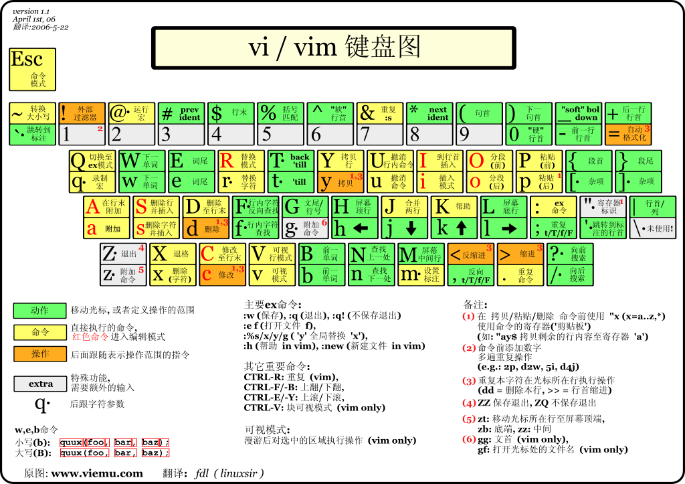

# vim

这不是新手教程，只记录一些常用操作。

vim命令可以由操作符 + 次数 + 动作来组成，比如d3w表示删除3个单词。

u：撤销修改

CTRL + R：恢复修改

## 移动

h, j, k, l：左下上右

e：跳转至下一个单词末尾

b:跳转至上一个单词开头

w：跳转至下一个单词开头

$：跳转至行末

CTRL + O：返回上次位置

CTRL + I：前往下次位置

0：跳转至行首

nG：跳转至第n行

GG：跳转至文件末尾

gg：跳转至文件开头

## 插入

a：光标后插入

A：行尾插入

i：光标前插入

I：行首插入

o：下一行插入

O：上一行插入

## 删除

x：删除光标处字符

dd：删除整行

D：删除至行末

dw：从当前光标位置，一直删除至下一个单词开头

d$：从当前光标位置，一直删除至行末

## 复制与粘贴

p：在光标下一行位置复制

y：复制选中内容，需要配合visual mode

yy：复制当前行

yw：复制一个单词

## 修改与替换

rx：将当前光标处字符修改为x

ce：修改单词

:s/old/new/g：将当前行的'old'全部改为'new'

:%s/old/new/g：将当前文件的'old'全部改为'new'

## 查找

按/进入查找模式，输入你要搜寻的字符串，然后：

n：查找下一个

N：查找上一个

%：搜寻下一个匹配的), ], }

